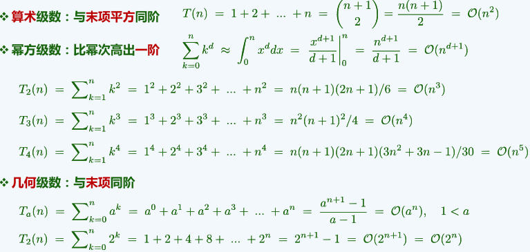
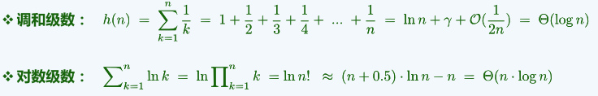
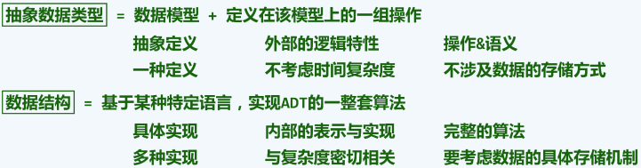
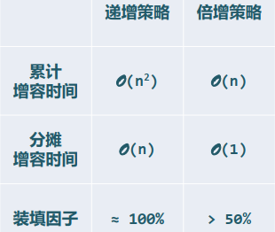
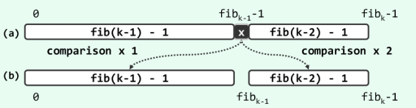
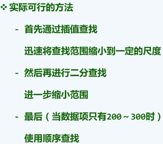

# 第一章 绪论

## （a）计算机与算法

计算是利用计算机这种工具可以重复地机械地完成的过程

研究计算的规律和技巧来实现高效、低耗的计算，Computing science

算法：即特定计算模型下，解决特定问题的指令序列

- 输入输出、确定性、可行性、正确性、有穷性；（鲁棒性、重用性）

  Hailstone sequence未必是一个算法，程序 ≠ 算法

- 好算法：正确、健壮、可读、效率

## （b）计算模型和复杂度分析

理想模型：

同一问题的多种算法为评判其优劣，抽象出一个理想的模型来准确地测量算法，不再依赖于种种具体的因素

- Turing Machine：Tape，Head，State

- Random Access Machine

  与TM模型一样，都是对一般计算工具的简化与抽象，使我们能够独立于具体的平台，对算法的效率做出可信的比较与评判，在这些模型中，将算法的运行时间转化为算法需要执行的**基本操作次数**

- 成本：运行时间+所需存储空间，问题的规模往往是决定计算成本的主要因素

- T(n)，在规模为n的所有实例中，只关注最坏情况(成本最高)

## （c）大O记号

渐进分析：只看计算成本随着问题规模增大后主要的、长远的变化趋势

大O记号：T(n)=O(f(n))，当n足够大后，有T(n) ≤ c*f(n)

- 高效解

  O(1)：常数复杂度，不含转向(循环、调用、递归等)，必顺序执行

  O(logn)：对数复杂度，低于任何多项式复杂度，常底数无所谓，因为logan = logab * logbn

- 有效解

  O(n^c)：统称多项式复杂度，抹掉低次项、常数项和系数

- 难解

  O(2 ^n)：指数复杂度

- 增长速度

  2^n > n^2 > nlogn > n > sqrt(n) > logn

## （d）算法分析

两个主要任务：复杂度和正确性

- 级数

- 循环

- 封底估算

  抓住问题的主要方面

## （e）递归与迭代

从递归(recursion)的程序转向更加高效的迭代(iteration)

- Decrease and conquer

  将大规模问题划分为一个规模缩减的问题和一个平凡的问题，分别求解子问题，由子问题的解得到原问题的解

- 递归跟踪

  直观形象，仅适用于简明的递归模式

- 递推方程

  间接抽象，更适用于复杂的递归模式

- Divide and conquer

  将大规模问题划分为若干子问题，分别求解子问题，由子问题的解得到原问题的解

## （xc）动态规划

- Fibnacci

- LCS

# 第二章 向量

## （a）接口与实现

## （b）可扩充向量

分摊分析

## （c）无序向量

- 循秩访问

  重载下标操作符"[ ]"

- 插入

  先判断是否需要expand()扩容，然后将后缀元素整体后移一个单位

- 区间删除

  删除后将后继元素整体向前移动，若有必要则shrink()缩容

- 唯一化

  在前缀中寻找雷同者；出于对效率的考虑，一般将其转化为有序向量再去重

- 遍历

  traverse(void (*visit)(T&))，利用函数指针统一对各元素分别实施操作

## （d1）有序向量：唯一化

- 有序性

  有序向量任意一对相邻元素顺序，**相邻逆序对**数目可以用来度量向量的逆序程度

- 唯一化（高效版）

  将不相等的元素左移

## （d2）有序向量：binSearch

- 语义

  确定 ≤e 的最后一个元素

- 查找长度

  分别针对查找成功与失败，从最好、最坏、平均等角度评估，均为O(1.5*logn)

## （d3）有序向量：fibSearch

- 构思

  转向左右分支前的比较次数不等，而递归深度却相同

- 黄金分割

## （d4）有序向量：二分查找(改进)

- 构思

  从3分支到2分支，查找失败时返回 ≤e 的最后一个元素，--lo

## （d5）有序向量：插值查找

- 原理

  有序向量中各元素为均匀且独立的随机分布时可采用interpolation search，每经过一次比较n缩至√n

- 综合对比

## （e）起泡排序

- 改进

  返回本次冒泡最右侧逆序对的位置，表示该位置后的元素无需再比较

## （f）归并排序

- 实现

  前一段数组开辟临时空间存储

# 第三章 列表

# 第四章 栈与队列

# 第五章 二叉树

# 第六章 图

