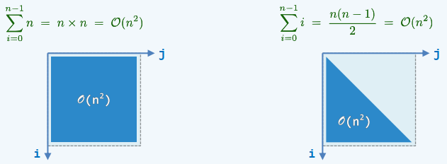
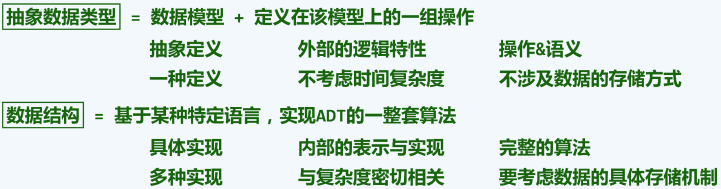
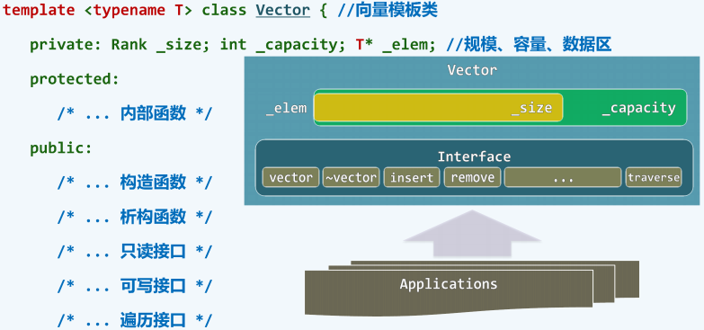
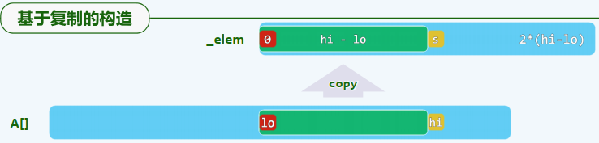
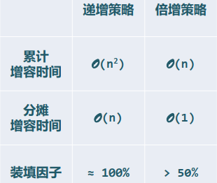

# Data Structure

## 第一章 绪论

## （a）计算

### 1-计算

研究计算的规律和技巧来实现高效、低耗的计算；Computing science

### 2-绳索计算机

计算是利用计算机这种工具可以重复地机械地完成的过程

### 3-尺规计算机

利用尺规这种计算机和一定的步骤(算法)来作图

### 4-算法

即特定计算模型下，解决特定问题的指令序列

输入输出、正确性、确定性、可行性、有穷性

### 5-有穷性

Hailstone sequence未必是一个算法，程序 ≠ 算法

### 6-好算法

正确、健壮、可读、效率

## （b）计算模型

### 1-性能测度

度量DSA的好坏

### 2-问题规模

成本：运行时间+所需存储空间

问题的规模往往是决定计算成本的主要因素

### 3-最坏情况

T(n)，在规模为n的所有实例中，只关注最坏(成本最高)者

### 4-理想模型

同一问题的多种算法如何评判其优劣

抽象出一个理想的模型来准确地测量算法，不再依赖于种种具体的因素

### 5-图灵机

Tape，Head，State

### 6-图灵机实例

在图灵机上完成将二进制非负整数加一的一个实例

### 7-RAM模型

- Random Access Machine

与TM模型一样，都是对一般计算工具的简化与抽象，使我们能够独立于具体的平台，对算法的效率做出可信的比较与评判，在这些模型中，将算法的运行时间转化为算法需要执行的基本操作次数

### 8-RAM实例

在RAM上完成向下取整的除法

## （c）大O记号

### 1-主流长远

只看计算成本随着问题规模增大后主要的、长远的变化趋势

### 2-大O记号

T(n)=O(f(n))：当n足够大后，有T(n)<c*f(n)

### 3-高效解

O(1)：常数复杂度，不含转向(循环、调用、递归等)，必顺序执行

O(logn)：对数复杂度，低于任何多项式复杂度，常底数无所谓，因为logan = logab * logbn

### 4-有效解

O(n^c)：统称多项式复杂度，抹掉低次项、常数项和系数

### 5-难解

O(2 ^n)：指数复杂度

### 6-2-Subset

直觉算法：逐一枚举每一子集，并统计其中元素的总和

### 7-增长速度

2^n > n^2 > nlogn > n > sqrt(n) > logn

## （d）算法分析

### 1-算法分析

两个主要任务：正确性和复杂度

### 2-级数

- 算数级数：与末项平方同阶
- 幂方级数，比幂次高出一阶
- 几何级数：与末项同阶
- 调和级数
- 对数级数

### 3-循环

### 4-实例：非极端元素+起泡排序

某些情况下无论输入规模多大，算法需要的执行时间都不变

### 5-正确性的证明

起泡排序经过n趟扫描后，算法必然终止，且能给出正确解答

### 6-封底估算1

### 7-封底估算2

抓住问题的主要方面

## （e）迭代与递归

### 1-迭代与递归

从递归(Recursion)的程序转向更加高效的迭代(Iteration)

### 2-减而治之

- Decrease and conquer

将大规模问题划分为一个规模缩减的问题和一个平凡的问题，分别求解子问题，由子问题的解得到原问题的解

### 3-递归跟踪

直观形象，仅适用于简明的递归模式

### 4-递推方程

间接抽象，更适用于复杂的递归模式

### 5-数组倒置

实例

### 6-分而治之

- Divide and conquer

将大规模问题划分为若干子问题，分别求解子问题，由子问题的解得到原问题的解

### 7-二分递归：数组求和

### 8-二分递归：Max2

### 9-Max2：二分递归

## （xc）动态规划

### 1-动态规划

### 2-Fib()：递推方程

### 3-Fib()：封底估算

### 4-Fib()：递归跟踪

### 5-Fib()：迭代

### 6-最长公共子序列

### 7-LCS：递归

### 8-LCS：理解

### 9-LCS：复杂度

### A-LCS：动态规划

## 第二章 向量(上)

## （a）接口与实现

### 1-接口与实现

### 2-向量ADT

### 3-接口操作实例

### 4-构造与析构

### 5-复制

## （b）可扩充向量

### 1 可扩充向量

### 2 动态空间管理

### 3 递增式扩容

### 4 加倍式扩容

### 5 分摊复杂度

## （c）无序向量

### 1 概述

### 2: 循秩访问

重载下标操作符"[ ]"

### 3 插入

先判断是否需要expand()扩容

### 4 区间删除

删除后若有必要则shrink()缩容

### 5 单元素删除

### 6 查找

input-sensitive

### 7 唯一化

### 8 遍历

## （d1）有序向量：唯一化

### 1 有序性

### 1-2 唯一化（低效版）

### 1-3 复杂度（低效版）

### 1-4 唯一化（高效版）

### 1-5 实例与分析（高效版）

## （d2）有序向量：二分查找

### 1 概述

### 2 接口

### 3 语义

### 4 原理

### 5 实现

### 6 实例

### 7 查找长度

## 第二章 向量(下)

## 第三章 列表

## 第四章 栈与队列

## 第五章 二叉树

## 第六章 图

