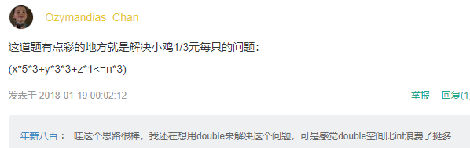

- 数据结构的定义的不同说法

数据结构是一种存储和组织数据的方式

- lastc = c

许多情况下需要记录上一次访问的数据，若需要回退，记录之前访问过的所有节点的时候使用栈

- state = IN

写算法时可能会用到的状态切换技巧

- 反序数函数

int Reverse(int x)

{

  int revx = 0;

  while (x) {

​     revx = revx * 10 + x % 10;

​     x /= 10;

  }

  return revx;

}

- 长度为n的数组，元素取值范围为[0，n-1]，判断数组中是否有重复元素

将每个数放到自己对应序号的位置上，可以在原数组上进行操作

- 白鸡问题中🐥1/3元一只

 

- 输入学生的学号和成绩，输出高于平均成绩的学生的学号和成绩

递归

 

- 将string的某一位转化成int

数字的ascii码是连续的，str[i] - '0',自动转换成对用的ascii中的数字进行计算

 

- 字母循环平移问题

对字母执行加法或减法操作后再对字母个数26取模

 

- 输入一行字符串

如果直接按照string进行输入，遇到空格就会停止,用getline( )来获取一行字符串

string str；

while（getline（cin，str）{

……

}

- TOP k问题

1）堆：k个元素建立小顶堆。 2）局部排序：冒泡排序。3）快速排序；4）分块查找

- 判断链表是否相交且找出交点

1.遍历两个链表并记录长度，如果最后一个结点相同则链表相交，并将长链向前遍历len1-len2个结点，然后两个链表同时遍历，第一个相同的结点即为相交结点

2.哈希表；遍历链表用结点地址建立哈希表，地址哈希值相同的点即为相交结点 