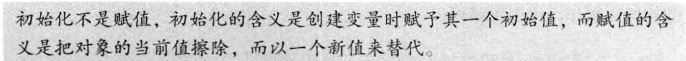
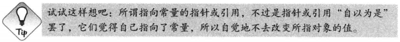
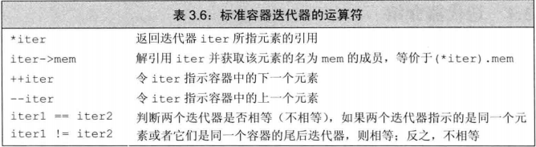
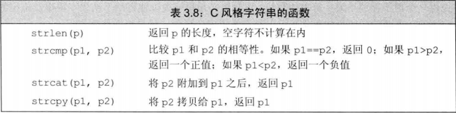
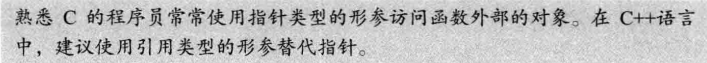
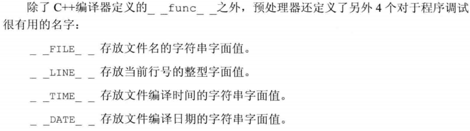

# 第1章 开始！！！看到第4章表达式（之后的笔记没更新）

## 1.1 编写一个简单的C++程序

built-in type

类型是程序设计最基本的概念之一，一种类型不仅定义了数据元素的内容，而且定义了这类数据上可以进行的运算。

### 1.1.1 编译、运行程序

最常用的编译器是GNU编译器和微软Visual Studio编译器

## 1.2 初识输入输出

C++语言并未定义任何IO语句，而是用标准库来提供IO机制

endl的效果是结束当前行，并将与设备关联的的缓冲区(buffer)中的内容刷到设备中

标准库定义的所有名字都在命名空间std中

## 1.3 注释简介

注释(comments)

## 1.4 控制流

### 1.4.1 while语句

### 1.4.2 for语句

### 1.4.3 读取数量不定的输入数据

当用一个istream对象作为条件时，检测的是流的状态

从键盘输入EOF：Windows是Ctrl+Z，UNIX包括Mac OS是Ctrl+D

### 1.4.4 if语句

## 1.5 类简介

### 1.5.1 Sales_item类

### 1.5.2 初识成员函数

## 1.6 书店程序

main函数是操作系统执行你的程序的调用入口

argument：实参

# 第Ⅰ部分 C++基础

# 第2章 变量和基本类型

动态数据类型语言是在程序运行时检查数据类型

## 2.1 基本内置类型

包括算术类型和空类型（void）

## 2.1.1 算术类型

arithmetic type，分为整型(integral type，包括整型数、字符和布尔类型)和浮点型

一般情况下，int占4字节，float占4字节(7个有效位)，double占8字节(16个有效位)

## 2.1.2 类型转换

表达式里既有无符号类型又有带符号类型时，带符号类型会自动转换成无符号类型

当我们给无符号类型赋一个超出它的表示范围的值的时候，结果是该值对无符号类型表示数值总数取模后的余数

## 2.1.3 字面值常量

每个literal都对应一种数据类型，literal的形式和值决定了它的数据类型

**整型字面值**可以写作十进制数、八进制数或十六进制数的形式，**浮点型字面值**表现为一个小数或以科学计数法表示的指数

**字符字面值**是由单引号括起来的一个字符，双引号括起来的0个或多个字符构成**字符串字面值**，字符串字面值实际上是由常量字符构成的数组，以空字符('\0')结尾

转义序列均以反斜线\作为开始

**布尔字面值**：true、false，**指针字面值**：nullptr

## 2.2 变量

### 2.2.1 变量定义

在C++中初始化和赋值是两个完全不同的操作

### 2.2.2 变量声明和定义的关系

为了支持分离式编译，C++语言将声明和定义区分开来

extern：声明一个变量而非定义它

### 2.2.3 标识符

即是变量命名

命名规范：变量名一般用小写字母，用户自定义类名一般以大写字母开头，多个单词组成应有区分，用下划线或第二个单词首字母大写

### 2.2.4 名字的作用域

全局作用域（global scope）

块作用域（block scope）

## 2.3 复合类型

compound type是指基于其他类型定义的类型

### 2.3.1 引用

我们使用术语引用时，指的其实是左值引用

 引用必须被初始化，引用不是对象，所以不能定义引用的引用(或指针)

### 2.3.2 指针

取地址符：&，解引用符：*

空指针：int *p1 = nullptr； //等价于int *p1 = 0；若使用NULL需要首先#include <cstdlib>

NULL是预处理变量，编译之前预处理器会将它替换为实际值

void*是一种特殊的指针类型，可以指向任意**非常量**，不能直接操作所指的对象

### 2.3.3理解复合类型的声明

最好将修饰符与变量标识符写在一起，着重强调变量具有的复合类型

要理解变量的类型最简单的方法是从右向左阅读变量的定义

## 2.4 const限定符

const对象必须初始化，编译器将在编译过程中把用到该变量的地方都替换成对应的值

 默认状态下，const对象仅在文件内有效

为了实现const对象在文件间共享，需要在声明或定义时都添加extern关键字，这样只需定义一次

### 2.4.1 const的引用

**reference to const**

 允许一个常量引用绑定非常量的对象、字面值和一般表达式

常量引用仅对引用可参与的操作做出了限定，即不能用来修改它所绑定的对象的值

### 2.4.2 指针和const

**pointer to const**

 允许一个指向常量的指针指向一个非常量对象

与常量引用类似，指向常量的指针仅仅要求不能通过该指针改变对象的值

**const pointer**

允许指针本身定义为常量，因此常量指针必须初始化，*const

### 2.4.3 顶层const

top-level const表示指针本身是个常量，low-level const表示指针所指的对象是一个常量

### 2.4.4 constexpr和常量表达式

const expression是指值不会改变并且在编译过程就能得到计算结果的表达式，字面值属于常量表达式，用常量表达式初始化的const对象也是常量表达式

 在一个复杂系统中很难分辨一个初始值是不是常量表达式

因此C++11规定允许将变量声明为constexpr类型以便由编译器来验证变量的值是否是一个常量表达式，声明为constexpr的变量一定是一个常量，而且必须用常量表达式初始化

**字面值类型**literal type：目前为止接触的算术类型、引用和指针都属于字面值类型

## 2.5 处理类型

### 2.5.1 类型别名

别名声明：using

### 2.5.2 auto类型说明符

 auto也能在一条语句中声明多个变量，因为一条声明语句只能有一个基本数据类型，所以该语句中所有变量的初始基本数据类型都必须一样

auto一般会忽略掉顶层const，如果希望推断出的auto类型是一个顶层const需要明确指出

### 2.5.3 decltype类型说明符

decltype返回变量的类型(包括顶层const和引用在内)

 引用从来都作为其所指对象的同义词出现，只有用在decltype处是一个例外

如果表达式的内容是解引用操作，则decltype将得到引用类型

decltype((variable))的结果是引用

## 2.6 自定义数据结构

### 2.6.1 定义Sales_data类型

类的定义最后加上分号

### 2.6.2 使用Sales_data类

### 2.6.3 编写自己的头文件

头文件通常包含那些只能被定义一次的的实体，如类、const和constexpr变量

preprocessor：确保头文件多次包含仍能安全工作的常用技术是预处理器，预处理器是在编译之前执行的一段程序，可以部分改变我们所写的程序

一项常用的预处理功能：头文件保护符，依赖于**预处理变量**，预处理变量有两种状态：已定义和未定义

\#define指令用于定义一个预处理变量

\#ifdef和#ifndf用来检查某个指定的预处理变量是否已经定义，一旦检查结果为真，则执行后续操作直至遇到#endif指令为止

使用这些功能就能有效防止重复包含的发生

整个程序的预处理变量包括头文件保护符必须唯一

# 第3章 字符串、向量和数组

string和vector都是对内置数组这种基础类型的抽象

## 3.1 命名空间的using声明

位于头文件的代码一般来说不应该使用using声明

## 3.2 标准库类型string

### 3.2.1 定义和初始化string对象

如果用一个**字符串字面值**初始化string，除了最后那个**空字符**外其他所有字符都被拷贝到新创建的string对象中去

使用“=”执行拷贝初始化，使用“( )”执行直接初始化

### 3.2.2 string对象上的操作

![计算机生成了可选文字: 0S〈<S 工S>>S get1ine{土s， s.empty() s·size0 s[n] sl+s2 sls2 sl=s2 s!=s2 s） 表3．2：stnng的操作 将s写到输出流。s当中，返回。5 从让中读取字符串赋给s，字符串以空白分隔，返回is 从中读取一行赋给s，返回is s为空返回tru宀否则返回false 返回s中字符的个数 返回s中第n个字符的引用，位置n从0计起 返回s1和s2连接后的结果 用s2的副本代替sl中原来的字符 如果sl和s2中所含的字符完全一样，则它们相等；string对象的相 等性判断对字母的大小写敏感 利用字符在字典中的颡序进行比较，且对字母的大小写敏感](../img/clip_image005-1612422460475.png)

size( )函数返回的是string::size_type类型，它是一个无符号整型数

当把string对象和字符字面值及字符串字面值相加时，必须确保每个加法运算符的两侧运算对象至少有一个是string，不能把字面值直接相加

在执行读取操作时，string对象会自动忽略开头的空白(空格符、换行符、制表符等)，从第一个真正的字符开始读直到遇见下一处空白为止

#### *使用**getline**读取一整行*

getline不会把换行符存入string对象

### 3.2.3 处理string对象中的字符

#### *范围**for**语句*

使用范围for语句处理每个字符，如果想改变string中字符的值，必须把循环变量定义成引用类型

## 3.3 标准库类型vector

vector是一个类模板而非类型，模板实例化创建类

### 3.3.1 定义和初始化vector对象

### 3.3.2 向vector对象中添加元素

push_back( )

不能用下标形式添加元素

### 3.3.3 其他vector操作

![计算机生成了可选文字: v.empty() v，size0 v.pushback(t) v[n] VI VI VI v2 《a，b，c， v2 表3、5；vector支持的操作 如果v不含有任何元素，返回真：古则返回假 返回v中元索的个数 向v的尾端添加一个值为《的元素 返回v中第n个位置上元素的引用 用v2中元素的拷贝替换VI中的元素 用列表中元素的拷贝替换VI中的元素 VI和v2相等当且仅当它们的元素数量相同且对应位置的元素值都相同 顾名思义，以字典顺序进行比较](../img/clip_image009-1612422460475.png)

下标的类型也是size_type

## 3.4 迭代器介绍

### 3.4.1 使用迭代器

begin( )，end( )，分别返回第一个元素和尾元素的下一位置，若容器为空则返回同一个迭代器

使用iterator和const_iterator(只能读不能修改它所指元素的值)来表示迭代器的类型

cbegin( )和cend( )专门得到const_iterator 

### 3.4.2 迭代器运算

距离是指右侧迭代器向前移动多少位置就能追上左侧迭代器，其类型是名为difference_type的带符号整型数，距离可正可负

缓冲区溢出（buffer overflow）：指试图通过一个越界的索引访问容器的内容，包括string、vector和数组

## 3.5 数组

### 3.5.1 定义和初始化内置数组

数组是一种复合类型

数组的维度必须是一个常量表达式

 数组不允许拷贝和赋值

允许定义指向数组的指针或引用

### 3.5.2 访问数组元素

数组可以使用范围for语句，下标类型是size_t

### 3.5.3 指针和数组

数组类型的对象其实是一个指向该数组首元素的指针，指向数组的指针可以执行所有迭代器运算

标准库函数begin和end(定义在头文件iterator)，将数组作为它们的参数，返回数组首元素的指针和尾元素下一位置的指针

对数组执行下标运算其实是对指向数组元素的指针执行下标运算

### 3.5.4 c风格字符串

以空字符'\0'结束的字符数组，字符串字面值是C风格字符串，传入以下函数的指针必须指向以空字符作为结束的数组

strcat( )拼接的时候不会保留前一个字符串的空字符

strcpy( )也不进行数组越界的检查

### 3.5.5 与旧代码的接口

允许使用以空字符结尾的字符数组来初始化string对象或为string对象赋值或作为其中一个运算对象

c_str( )函数返回一个C风格字符串，也就是返回一个指针const char*，该指针指向一个以空字符结束的字符数组

可以使用数组初始化vector对象，指明拷贝区域的首元素地址和尾后地址

## 3.6 多维数组

# 第4章 表达式

- 3.6

严格来说，C++没有多维数组，通常说的多维数组其实是数组的数组

**四**

概念：作用于内置类型运算对象的运算符；表达式；

- 4.2

算术运算符的运算对象和求值结果都是右值

- 4.3
- 4.4

列表初始化不能损失精度，不然会窄化转换报错

- 4.5

![建 议 ： 除 非 必 须 ， 否 则 不 用 递 增 递 减 运 算 符 的 后 置 版 本  有 c 语 言 背 景 的 读 者 可 能 对 优 先 使 用 前 置 版 本 递 增 运 算 符 有 所 疑 问 ， 其 实 原 因 非 常  简 单 ： 前 置 版 本 的 递 增 运 算 符 避 免 了 不 必 要 的 工 作 ， 它 把 值 加 1 后 直 接 返 回 改 变 了 的 运  算 对 象 。 与 之 相 比 ， 后 置 版 本 需 要 将 原 始 值 存 储 下 来 以 便 于 返 回 这 个 未 修 改 的 内 容 。 如  果 我 们 不 需 要 修 改 前 的 值 ， 那 么 后 置 版 本 的 操 作 就 是 一 种 浪 费 。  对 于 整 数 和 指 针 类 型 来 说 ， 编 译 器 可 能 对 这 种 额 外 的 工 作 进 行 一 定 的 优 化 ； 但 是 对  于 相 对 复 杂 的 迭 代 器 类 型 ， 这 种 额 外 的 工 作 就 消 耗 巨 大 了 。 建 议 养 成 使 用 前 置 版 本 的 习  惯 ， 这 样 不 仅 不 需 要 担 心 性 能 的 问 题 ， 而 且 更 重 要 的 是 写 出 的 代 码 会 更 符 合 编 程 的 初 衷 。 ](../img/clip_image013-1612422460476.png)

The prefix operators return the object itself as an **lvalue**.

The postfix operators return a copy of the object's original value as an **rvalue**.

- 4.6

箭头运算符与点运算符：ptr->men等价于(*ptr).mem

- 4.7

条件运算符(**? :**)：condition ? expr1 : expr2

- 4.8

位运算符：

移位运算符：<<、>> 的内置含义是对其运算对象执行基于二进制位的的移动操作

位求反运算符：~

位与、位或、位异或运算符：&，|，^ 

异或：两个位不同为1，相同为0；也叫半加法运算，即不进位的加法，0异或任何数=任何数，1异或任何数=任何数取反，任何数异或自己=把自己置0

一个整数可以看作是位的集合从而使用位运算符来处理数据：

1）使用位与可以将位设置为0，也可以检查某一位是0还是1

2）使用位或可以将位设置为1

3）使用位异或可以使某些特定的位取反；可以实现两个值的交换；将变量置0；快速判断两个值是否相等

- 4.9

sizeof运算符，返回值是一个常量表达式

指针占几个字节和系统的寻址能力有关，而与语言无关

- 4.10

逗号运算符常常运用在for循环中

逗号运算符会计算左右两个表达式，然后返回右侧表达式的值

- 4.11

隐式转换

强制类型转换(cast)

cast-name<type>(expression)

static_cast

const_cast

C语言风格强制类型转换：（type）expr

**五、语句**

概念：表达式语句、声明语句；条件语句，(迭代)循环语句，跳转语句、异常处理

- 5.1

statement

compound statement：block

- 5.2
- 5.3

case标签必须是整形常量表达式

default标签：默认情况

- 5.4

迭代语句通常称为循环

- 5.5

跳转语句：break、continue、goto、return

- 5.6

典型的异常包括遇到意外输入以及失去数据库连接等

runtime_error的what成员返回的是初始化一个具体对象时所用的string对象的副本

如果没找到任何匹配的catch子句或者没有任何try语句块定义的异常，系统会调用terminate函数终止

**六、函数**

概念：形参、实参，inline，默认参数，函数指针

- 6.1

执行函数的第一步：(隐式地)定义并初始化函数的形参，实参是形参的初始值

return语句一是返回值，二是将控制权从从被调函数转移回主调函数

形参和函数体内部的的变量统称为局部变量

局部静态对象：将局部变量定义成static类型，只初始化一次

建议函数应该和变量一样在头文件中声明，在源文件中定义

- 6.2

形参的初始化机理和变量初始化一样

值传递：将实参的值拷贝给形参，形参和实参是两个相互独立的对象

引用传递：引用形参是它对应的实参的别名

指针作为形参的函数在调用时要传入对象的地址，而引用形参可以直接传入对象

使用引用形参可以避免拷贝，拷贝大的类类型的对象或者容器对象比较低效，而且有的类类型（包括IO类型）不支持拷贝操作，只能通过引用形参访问该类型的对象

当函数无需修改引用形参的值时尽量使用常量引用，使用普通引用的坏处在于一是给函数的调用者带来误导，认为函数可以修改实参的值，二是使用非常量引用会限制函数能接受的实参类型，不能把const对象、字面值和需要类型转换的对象传递给普通的引用形参

 

因为不能拷贝数组，所以不能以值传递的方式使用数组参数，数组形参都是const int*类型

传递数组引用形参才能限制数组的大小

 

int main(int argc,char **argv) {...}

initializer_list是一种标准库类型，用于表示某种特定类型的值的数组

省略符形参

- 6.3

return语句终止当前正在执行的函数并将控制权返回到调用该函数的地方

返回void的函数不要求有return语句，这类函数最后会隐式地执行return

不要返回局部对象的引用或指针

调用一个返回引用的函数得到左值，其他返回类型得到右值

允许main函数没有return直接结束，编译器将隐式地插入一条返回0的return语句，返回0表示执行成功，返回其他值表示执行失败

尾置返回类型->

- 6.4

重载函数：同一作用域内的几个函数名字相同但形参列表不同，编译器根据实参的类型确定应该调用哪一个函数

一个拥有顶层const的形参无法和另一个没有顶层const的形参区分开来

- 6.5

默认实参作为形参的初始值出现在形参列表中，一旦某个形参被赋予了默认值，它后面的所有形参都必须有默认值

在调用函数时省略实参就能够使用默认实参，但只能省略尾部的实参

 

调用一个小函数比求等价的表达式要慢一些，inline函数可避免函数调用的开销

内联机制用于优化规模较小、频繁调用的函数

 

constexpr函数是指能作用于常量表达式的函数，函数的返回类型和形参的类型都必须是字面值类型，不一定返回常量表达式

inline和constexpr函数通常定义在头文件中

- 6.6

调用重载函数时应尽量避免强制类型转换

- 6.7

把函数名作为一个值使用时，该函数自动地转换成指针

函数可以作为形参，会自动转换成指向函数的指针

也可以把函数作为实参使用，它会自动转换成指针

可以直接使用函数指针调用该函数，无需解引用

**七、类**

- 7.1

类的基本思想是数据抽象和封装

数据抽象是一种接口和实现分离的编程技术，能帮助我们将对象的具体实现与对象所能执行的操作分离开来

封装是接口与实现的分离，它隐藏了类的实现细节，在C++封装是将实现放在类的私有部分，类的用户只能使用接口而无法访问实现部分

封装的作用：确保用户代码不会无意间破坏封装对象的状态；被封装的类的具体实现可以随时改变，而不需要调整用户级代码，只要类的接口不变，用户代码就无需改变

成员函数必须声明在类的内部，定义可以在内部或外部，作为接口组成部分的非成员函数，定义和声明都在类的外部

定义在类内部的函数是隐式inline函数

当我们调用成员函数时，用请求该函数的对象的地址初始化this，this是一个常量指针

const成员函数中const的作用是修饰this指针的类型，把this设置为指向常量的指针，const成员函数对调用它的对象的数据成员只读

常量对象，以及常量对象的引用或指针只能调用const成员函数

IO类型的对象作为函数参数或返回值时：IO类属于不能被拷贝的类型，只能通过引用传递

istream& read(istream& is，type& rhs）； read（cin，rhs）； //return is

ostream& print（ostream& os，const type& rhs）；print（cout，rhs）；//return os

 

构造函数不能被声明成const

如果类没有显示地定义构造函数，编译器会隐式地定义一个默认构造函数

= default 要求编译器生成默认构造函数

构造函数初始值列表

类中的函数用到类外定义的函数时要在类之前声明该函数，若该函数用到了类内的成员，又要在该函数前声明类

拷贝、赋值和析构函数未显示定义时编译器会自动合成

- 7.2

访问说明符

定义在public之后的成员在整个程序内可被访问，public成员定义类的接口

定义在private之后的成员可以被类的成员函数访问，private部分封装了（即隐藏了）类的实现细节

- 7.3

类型成员：自定义某种类型在类中的别名

可变数据成员：声明中加入mutable关键字，任何成员函数包括const成员函数可以改变可变数据成员的值

通过区分成员函数是否是const，可以对它进行重载

当一个成员函数调用另外一个成员函数时，this指针在其中隐式地传递，例如，当非常量成员函数调用常量成员函数时，它的this指针将隐式地从指向非常量的指针转换成指向常量的指针

- 7.4
- 7.5

如果成员是const、引用或某种未提供默认构造函数的类类型，必须通过构造函数初始值列表为这些成员提供初值

如果一个构造函数为所有参数都提供了默认实参，则它实际上也定义了默认构造函数

委托构造函数

可以通过将构造函数声明成explicit阻止隐式转换，explicit关键字只允许出现在类内的构造函数声明出

关键字explicit只对一个实参的构造函数有效，需要多个实参的构造函数不能用于执行隐式转换所以无需声明

聚合类

- 7.6

类的静态成员存在于任何对象之外 