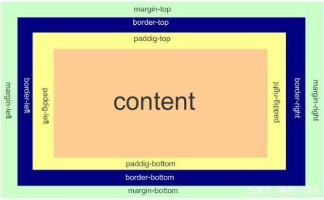

- # HTML

- HTML由一系列的elememts组成

- 

- 元素可以有属性（Attribute）

- 

- 属性包含了关于元素的一些额外信息，这些信息本身不应显现在内容中。本例中，class 是属性名称，editor-note 是属性的值 。class 属性可为元素提供一个标识名称，以便进一步为元素指定样式或进行其他操作时使用。

- 属性应该包含：

- 1. 在属性与元素名称（或上一个属性，如果有超过一个属性的话）之间的空格符。
  2. 属性的名称，并接上一个等号。
  3. 由引号所包围的属性值。

- # 常用标签

- 元数据（Metadata）是数据的数据信息。

- META元素通常用于指定网页的描述，关键词，文件的最后修改时间，作者及其他元数据。

- 元数据可以被使用浏览器（如何显示内容或重新加载页面），搜索引擎（关键词），或其他 Web 服务调用。

- ## 行内元素

- 对文档中的行内元素进行组合

- <b>规定粗体文本

- <strong>定义加粗的被强调的文本

- <button>定义一个按钮

- ## 块级元素

- <h>定义不同等级的标题

- <ul>无序列表

- <ol>有序列表

- 
显示一条水平线

- #  CSS

- CSS是一种用来表现HTML或XML等文件样式的计算机语言

- # 规则集

- CSS 规则由两个主要的部分构成： 选择器， 以及一条或多条声明。

- selector {declaration1; declaration2; ... declarationN }

- 每条声明由一个属性和一个值组成。 每个属性有一个值。 属性和值被冒号分开。

- selector {property :  value} 

- 

- # CSS引用方式

- 外部样式表

- <head>

- <link rel="stylesheet" type="text/css" href="mystyle.css">

- </head>

- 内部样式表

- <head>

- 

- </head>

- 内联样式

- 

- This is a paragraph

- </p

- # CSS选择器

- ## 类选择器

- 类名前有一个点号（ .）

- ## ID选择器

- ID名前有一个井号（ #）

- 派生选择器

- 依据元素在其位置的上下文关系来定义

- li strong {

- font-style: italic;

- font-weight: normal;

- } 

- # CSS盒模型

- 

- # CSS定位

- CSS 有三种基本的定位机制： 普通流、 (相对)绝对定位和浮动

- 普通流： 除非专门指定， 否则所有框都在普通流中定位。 普通流中元素框的位置由元素在(X)HTML中的位置决定。块级框从上到下一个接一个地排列， 框之间的垂直距离是由框的垂直外边距计算出来。 

- 相对定位：定位元素的位置相对于它在普通流中的位置进行移动

- 绝对定位：绝对定位的元素位置是相对于距离它最近的那个已定位的**祖先**(相对/绝对)元素决定