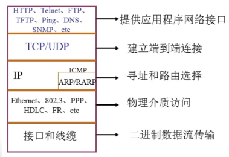

# 简介

HTTP是一个规则系统，一种协议，把应用程序和超文本文档之间的传输联系起来，它遵循一个简单的模型：从客户端发出请求到服务器并等到响应，因此它也被认为是一种“请求--响应”协议；HTTP本质上是一个无状态的(每一个请求/响应周期与前一个都是互相独立)互联网协议，需要web开发人员来模拟出web应用中有状态的体验

# HTML

 

# CSS

层叠样式表，定义如何显示HTML元素

# URL

分解成三部分，常见的URL模式还有ftp、git等

URL可以包含一个主机用来监听HTTP请求的端口号，如果没有指定其他端口号就等价于用默认端口号80代替

### 查询字符串/参数

通过URL传递时，仅仅使用HTTP的GET请求

### URL编码

默认只接受ASCII码

# HTTP

## 发起请求

### 过程

在审查器的NetWork标签下，除了第一个请求，还有一堆其他请求的返回：

①对于最初的请求返回了一些HTML

②这些HTML里又引用了其他的资源比如图片、CSS文件等

③浏览器会对得到的初次响应里的每一个资源再一一发起请求

审查器*Network*标签里Method表示请求方法，Status显示了每一个请求的响应状态码，每一个请求都会得到一个响应，哪怕是一个错误响应

post通过HTTP正文传输数据

## 处理响应

### 状态码

| **状态码** | **状态文本**          | **含义**                                        |
| ---------- | --------------------- | ----------------------------------------------- |
| 200        | OK                    | 请求被正确处理                                  |
| 302        | Found                 | 所请求的资源已暂时更改.通常会重定向到另一个 URL |
| 404        | Not Found             | 所请求的资源无法找到                            |
| 500        | Internal Server Error | 服务器出现一般性错误                            |

## 有状态的WEB应用

### 会话（session）

服务器在发送响应数据给客户端的时候带一个唯一的令牌(token)，随后不论何时客户端在向服务器发起请求的时候都把这个令牌附在后面，让服务器能够辨识这个客户端，web开发领域把这个来回传递的令牌叫做会话标识符（session identifier）

### Cookie

cookie是一个常用的存储会话信息的方法，cookie就是在一个请求/响应周期内，服务器发送给客户端并存储在客户端中的一段数据，在客户端发起一个请求的时候，服务器就会比对客户端的cookie和服务器上的会话数据，用来标识当前的会话

 

### AJAX

Asynchronous JavaScript and XML

主要特点是允许浏览器发送请求和处理响应的时候不用刷新整个页面

服务器处理AJAX请求的方法跟处理普通请求是一样的，唯一不同就是不是通过浏览器刷新来处理响应，而通常由客户端的一些javascript代码来处理

## 安全性

https通过TLS加密协议在加密消息，TLS(Transport Layer Security)之前使用SSL(Secure Sockets Layer)

这些加密协议在加密数据之前，需要先使用证书来与远程服务器进行通信来交换安全密钥

 