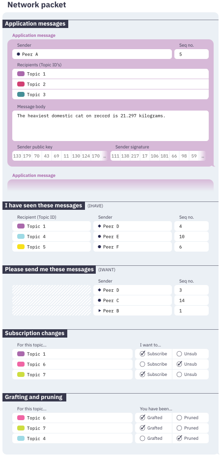
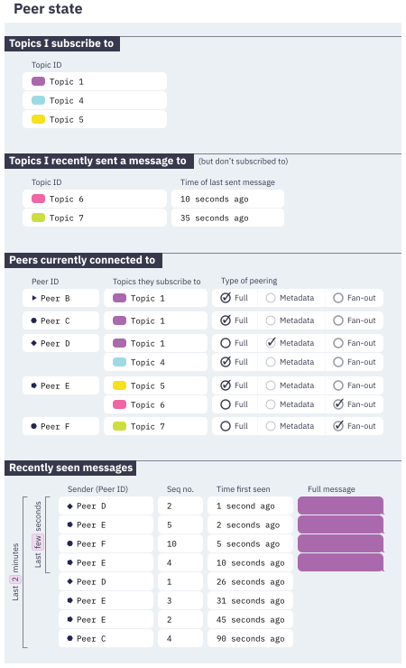
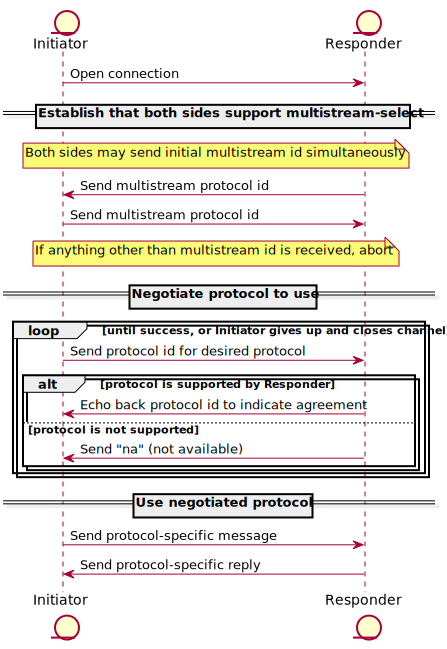

# Overview

**libp2p** is a modular system of *protocols*, *specifications* and *libraries* that enable the development of peer-to-peer network applications

What problems can libp2p solve?

- Transport

  libp2p provides a simple [interface](https://github.com/libp2p/js-libp2p-interfaces) that can be adapted to support existing and future transport layer(the foundation of libp2p) protocols, allowing libp2p applications to operate in many different runtime and networking environments

- Security

  upgrading a connection into a securely encrypted channel. 

- Identity

  libp2p uses *public key cryptography* as the basis of peer identity,

- Peer Routing

  Peer routing is the process of discovering peer addresses by leveraging the knowledge of other peers. 

- Content Discovery

  We may want some specific piece of data, but we don’t care who we get it from since we’re able to verify its integrity, libp2p provides a content routing interface 

- Messaging / Pubsub

  libp2p defines a pubsub interface for sending messages to all peers subscribed to a given “topic”.

# Concepts

## Transport

- ***transport agnostic***.

- core operations: **listening** and **dialing**

   every transport in a libp2p implementation will share the same programmatic interface

- ***multiaddr***

- ***switch***: responsible for composing ***multiple transports*** into a single interface,

   provides a single “entry point” for dialing and listening

## NAT Traversal

- Automatic router configuration

- Hole-punching

  an external peer can can tell us what address they observed us on

- AutoNAT

  lets peers request dial-backs from *peers providing the AutoNAT service*.

- Circuit Relay


## Secure Communication

--

## Circuit Relay

- Not transparent

- Relay address

  `/ip4/7.7.7.7/tcp/55555/p2p/QmRelay/p2p-circuit/p2p/QmAlice`

  Everything prior to the `/p2p-circuit/` is the address of the relay peer

- Autorelay

  a peer can discover relay peers using libp2p’s *content routing interface*

  When *AutoNAT service* detects we’re behind a NAT that blocks inbound connections, Autorelay jumps into action

## Protocols

A libp2p protocol has these **key features**:

- Protocol Ids

  path-like structure, with a version number as the final component

- Handler functions

  register handler functions for protocols using their protocol id with the switch. The handler function will be invoked when an incoming stream is tagged with the registered protocol id

- Binary streams

  The format of the binary data and the mechanics of what to send when and by whom are all up to the protocol to determine

**Protocol Negotiation:**

- Matching protocol ids and versions

  When register a protocol handler, there are two methods, takes two arguments: a protocol id, and a handler function, or takes three arguments: the protocol id, a protocol **match function**, and the handler function.

  When protocol id doesn’t have any exact matches, the protocol id will be passed through all of the registered match functions. If any returns true, the associated handler function will be invoked.

  semantic versioning (aka ***semver***)

- Dialing a specific protocol

  When dialing can optionally provide a list of protocol ids

**Core libp2p protocols:**

- Common patterns

  use **protobuf** to define message schemas

- Ping

  dialing peer verify the response and measure the latency between request and response.

- Identify/push

  allows peers to exchange information about each other

- secio

  secure input/output, for encrypted communication

  work is progressing on integrating **TLS 1.3** into libp2p, which is expected to become the default once completed

- Kad-dht

  libp2p uses the DHT as the foundation of its peer routing and content routing

- Circuit Relay

## Peer Identity

A PeerId is a cryptographic hash of a peer’s public key. When peers establish a secure channel, the hash can be used to verify that the public key used to secure the channel is the same one used to identify the peer.

A ***PeerInfo*** combines a PeerId with a set of multiaddrs that the peer is listening on.

libp2p applications will generally keep a “*peer store*” or “*peer book*” that maintains a collection of PeerInfo objects for all the peers that they’re aware of.

## Content Routing

--

## Peer Routing

--

## Addressing

Combing “location multiaddr” (IP and port) and “identity multiaddr” (libp2p PeerId),  and can be extended to account for multiple layers of addressing and abstraction. (For example, circuit)

## Security Considerations

- Identity and Trust

  Peer ids and their corresponding keys allow us to ***authenticate*** remote peers.

  ***authorization***

  1. protocol handler could reject requests from untrusted peers.
  2. accepts usernames and passwords and responds with a signed **token**
  3. “reputation” system, taking the **score** into account

- Cooperative Systems with Abuse Potential

  1. Kad-DHT

     *Sybil attacks* and *Eclipse attacks*, A DHT query may need to be routed through several peers before completion, each of which has the opportunity to modify query responses, either by returning incorrect data or by not returning data at all. 

     Applications can guard against modification of data by signing values that are stored in the DHT, or by using content addressing, where a cryptographic hash of the stored value is used as the key,

     currently planning to implement a strategy of querying *multiple disjoint lookup paths* in parallel.

  2. Publish/Subscribe

     it may be possible for peers to interfere with `gossipsub`’s routing algorithm

## Publish/Subscribe

***gossipsub***

- Peers can send messages to topics. Each message gets delivered to all peers subscribed to the topic

- Discovery

  *ambient peer discovery*

  - Distributed hash tables
  - Local network broadcasts
  - Exchanging peer lists with existing peers
  - Centralized trackers or rendezvous points
  - Lists of bootstrap peers

- Types of peering

  - Full-message

    transmit the full contents of messages; This network is sparsely-connected with each peer only being connected to a few other peers, this sparsely-connected network is called a *mesh* and peers within it are called *mesh members*

    The *peering degree* (also called the *network degree* or *D*) controls the trade-off between speed, reliability, resilience and efficiency of the network. default peering degree is 6 with anywhere from 4–12 being acceptable.

  - Metadata-only

    densely-connected network, which is made up of all the network connections between peers that aren’t full-message peerings, shares gossip about which messages are available and performs functions to help maintain the network of full-message peerings

- Grafting and pruning

  Either peer can **change** the connection type by notifying the other, each peer performs a series of checks every 1 second. These checks are called the ***heartbeat***. Grafting and pruning happens during this time

- Subscribing and unsubscribing

  Keeping track of subscriptions happens by sending **subscribe** and **unsubscribe** messages. Subscribe and unsubscribe messages go hand-in-hand with graft and prune messages.

- Sending messages

  When a peer wants to publish a message it sends a copy to all full-message peers it is connected to, when a peer receives a new message from another peer, it stores the message and forwards a copy to all other full-message peers it is connected to

  Peers remember a list of recently seen messages. This lets peers act upon a message only the first time they see it and ignore retransmissions.

- Gossip

  Peers gossip about messages they have recently seen. Every 1 second each peer randomly selects 6 metadata-only peers and sends them a list of recently seen messages. Gossiping gives peers a chance to notice in case they **missed** a message on the full-message network.

- Fan-out

  Peers are allowed to publish messages to topics they are not subscribed to,  it randomly picks 6 peers that are subscribed to that topic and remembers them as **fan-out** peers for that topic,

  After 2 minutes of not sending any messages to a topic, all the fan-out peers for that topic are forgotten

- 

- 

## Stream Multiplexing

multiple independent logical streams all share a common underlying transport medium.Applications can enable support for multiple multiplexers.

- Switch

  libp2p maintains some state about known peers and existing connections in a component known as the switch. The switch provides a dialing and listening interface that abstracts the details of which stream multiplexer is used for a given connection.

# Glossary

https://docs.libp2p.io/reference/glossary/

# Specs

the specifications for libp2p, a framework and suite of protocols for building peer-to-peer network applications

## Specs Framework

--

## Core Abstractions and Types

### Connection Establishment in libp2p 

#### Protocol Negotiation

- protocol id

  path-like structure containing a short name and a version number, `/mplex/1.0.1`

- multistream-select

  libp2p uses a protocol called multistream-select for protocol negotiation.

  

- Upgrading Connections 

  the connection upgrade process uses protocol negotiation to decide which specific protocols to use for each capability

#### Practical Considerations

- Interoperability

  Support for connection security protocols and stream multiplexers varies across libp2p implementations. The recommended baseline are *SECIO* and *mplex*.

- State Management

  - Peer Matadata Storage

    peer id and last known valid addresses for each peer

  - Connection Limits

    maintain an upper bound on the number of open connections

- Connection Lifecycle Events

  support a event delivery system that can inform interested parties about connection lifecycle events.

#### Future Work

improvement

- multistream-select
- connection management-->resource management
- event delivery

### Peer Ids and Keys 

 keys serialized , and how peer ids are generated from the hash of serialized public keys.

#### Keys

encodes keys in a ***protobuf*** containing a *key type* and the *encoded key* (each key type has its own encode format)

Keys are used in two places

- signing messages
- generating peer ids

#### Peer ids

Peer IDs are derived by hashing the *encoded public key* with multihash.

- string representation (encoding)

  *base58* encoded *mutihash*, *multibase* encoded *CID*

- decoding

  - If it starts with `1` or `Qm`, decode it according to the base58btc algorithm
  - If it starts with a multibase prefix, it's a CIDv1

## Protocols

wire protocols that are used by libp2p for connectivity, security, multiplexing, and other purposes

### Identify

The identify protocol is used to exchange basic information with other peers in the network, including addresses, public keys, and capabilities

- identify， `/ipfs/id/1.0.0`
- identify/push, `/ipfs/id/push/1.0.0`

- The Identify Message

  ```
  message Identify {
    optional string protocolVersion = 5;
    optional string agentVersion = 6;
    optional bytes publicKey = 1;
    repeated bytes listenAddrs = 2;
    optional bytes observedAddr = 4;
    repeated string protocols = 3;
  }
  ```

### mplex

Stream Multiplexer protocol

- message format

  `| header  | length  | data           |`
  `| uvarint | uvarint | 'length' bytes |`

  The header is an unsigned base128 varint, the lower three bits are the message flags, and the rest of the bits (shifted down by three bits) are the stream ID.

- Opening a new stream

- Writing to a stream

- Closing a stream

  closes it for writing and closes the remote end for reading but allows writing in the other direction.

- Resetting a stream

  To immediately close a stream for both reading and writing, use reset, this should generally only be used on error

- due to the lack of *backpressure* at the protocol level, the implementation must handle *slow readers*

  the go-mplex implementation blocks for a short period of time and then resets the stream if necessary.

### Plaintext Secure Channel

Intended only for debugging and interoperability testing purposes

- Prerequisites

  established a dedicated bidirectional channel between both parties, and the **plaintext protocol** has been negotiated as part of the connection upgrade process

- Exchange

  Once the plaintext protocol has been negotiated, both peers immediately send an Exchange message. Upon receiving an Exchange message from the remote peer, each side will validate the peer id.

- Messages

  Peers exchange their peer id and pubilc key using the protobuf

  all messages are prefixed with the message length in bytes.

### Pre-shared Key Based Private Networks

A private network is defined by the 256-bit secret key, which has to be known and used by all members inside the network.

- Security Guarantees

  Nodes of different private networks must not be able to connect to each other

- Safeguard

  a safeguard implemented that prevents dialing without no PSK set

- Cryptograph of Private Networks

  traffic in a private network is encrypted twice, once with PSK and once with the regular cryptographic stack for libp2p (secio or in the future TLS1.3)

- Stream ciphers

  Salsa20

### PubSub interface

- The RPC

  All communication happens in the form of exchanging protobuf RPC messages between participating peers.

- The Message

  The RPC message can contain zero or more messages of type 'Message'

  ```
  message Message {
  	optional string from = 1;
  	optional bytes data = 2;
  	optional bytes seqno = 3;
  	repeated string topicIDs = 4;
  	optional bytes signature = 5;
  	optional bytes key = 6;
  }
  ```

- Message Identification

  *origin-stamping*, `message_id`, `from` and `seqno` fields

  or, `message_id_fn`, the hash of the `data` field within the `Message`

  go-libp2p-pubsub plans to push down the configuration of the `message_id_fn` to the topic level

- Message Signing

- The Topic Descriptor

  The `TopicDescriptor` message is used to define various options and parameters of a topic.  It currently specifies the topic's human readable `name`(or, `hashedTopicDescriptor`, or `CID`), its authentication options, and its encryption options

  - AUthOpts
  
    The `AuthOpts` message describes an authentication scheme. 
  
  - EncOpts
  
  

### Circuit Relay


### Rendezvous protocol


### SECIO


### TLS Handshake


