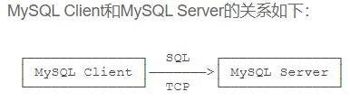
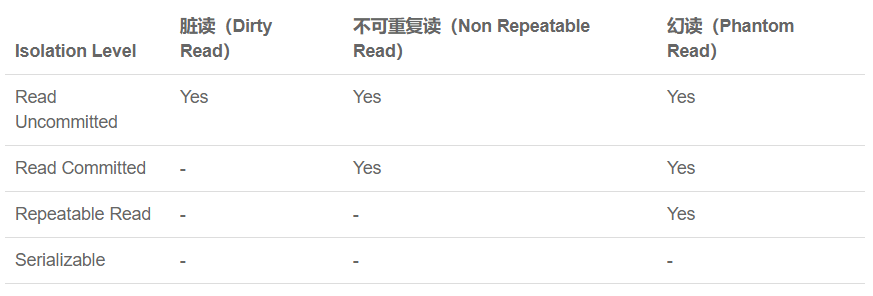

- # MySQL

- Innodb：MySQL的数据库引擎，支持事务

- - 关系模型

- 字段定义了数据类型，以及数据是否允许为NULL，NULL表示数据不存在，而不是0或空串

- 

- 主键：能够通过某个字段区分出不同的记录，这个字段称为主键

- 联合主键：多个字段标识唯一记录

- 外键：外键是另一个关系的主键，通过外键可以实现一对多、多对多和一对一的关系

- 索引：对一列或多列的值进行排序的一种结构，可以根据散列值互不相同的一列创建索引，提高查询效率，索引对于用户和应用程序来说是透明的；数据库会自动对主键创建主键索引，索引用B树或者B+树实现，通过索引查找的时候时间复杂度变为logn

- - 查询数据

- SELECT * FROM <表名> WHERE <条件表达式>，*表示所有列

- 条件查询：NOT(<>)，AND，OR，LIKE(判断相似)

- 投影查询：让查询的结果集只包含指定列，SELECT 列1 别名1, 列2 别名2, 列3 别名3 FROM …，结果集列的顺序可以和原表不一样

- 排序：ORDER BY … ASC/DESC，ORDER子句要放在WHERE子句后面，如果排序列有相同数据，可以继续添加列名，先按第一列排序，如果相同的再按第二列排序

- 分页查询：LIMIT M OFFSET N，M表示每页多少条记录，N表示从第N+1条记录开始

- 聚合查询：查询记录数总数，某列的总和、平均值、最大值、最小值，使用聚合函数COUNT,SUM,AVG,MAX,MIN…，

- 分组聚合：GROUP BY 字段，查询结果按指定字段分组

- 多表查询：SELECT * FROM <table1>,<table2>;笛卡尔查询；表名.列名；允许给表设置别名

- 连接查询：内连接：FROM <主表>  INNER JOIN <表2>  ON <条件>；外连接：(LEFT/RIGHT) OUTER JOIN；区别是内连接只返回同时存在于两张表的数据，右连接返回右表都存在的行，如果某一行仅在右表存在，那么结果集就会以NULL填充剩下的字段，左连接和全连接同理

- 子查询：在一个查询中使用另一个查询结果

- 将查询结果写入表：INSERT INTO … SELECT..FROM;

- 强制使用指定索引：SELECT * FROM students FROCE INDEX (…) …;

- - 修改数据

- INSERT INTO <表名>  (字段1，字段2，…) VALUES  (值1，值2，…)，（…) … ;字段顺序不必和数据库字段顺序一致，可以一次性添加多条记录

- DELETE FROM <表名> WHERE <条件>；不带WHERE的DELETE会删除整个表的数据

- UPDATE <表名> SET 字段1 = 值1，字段2 = 值2，…WHERE <条件>；

- ---------->

- REPLACE INTO <表名>  (字段1，字段2，…) VALUES  (值1，值2，…); 插入或替换

- INSERT INTO <表名>  (字段1，字段2，…) VALUES  (值1，值2，…) ON DUPLICATE KEY UPDATE ……; 插入或更新

- INSERT IGNORE INTO …; 插入或忽略

- 修改表的一列：ALTER TABLE students ADD/DROP/CHANGE COLUM ……

- - 登录

- MySQL Client是一个命令行客户端

- mysql -h 10.0.1.99 -u root -p

- 

- 在MySQL Client中输入的sql语句通过TCP发送到MySQL Server，默认端口号是3306，如果发送到本机，地址就是127.0.0.1：3306

- 也可以只安装MySQL Client，然后连接到远程MySQL Server。假设远程MySQL Server的IP地址是10.0.1.99，那么就使用-h指定IP或域名：mysql -h 10.0.1.99 -u root -p

- - 其他语句

- 创建数据库：CREATE DATABASE test;

- 删除数据库：DROP DATABASE test;

- 创建表：CREATE TABLE students;

- 删除表：DROP TABLE students;

- 查看表的结构：DESC students;

- 查看创建表的SQL语句：SHOW CREATE TABLE students;

- 修改表：①新增一列：ALTER TABLE students ADD COLUM birth VARCHAR(10) NOT NULL;②修改列名和类型：ALTER TABLE students CHANGE COLUM birth birthday VARCHAR(20) NOT NULL;③删除列：ALTER TABLE students DROP COLUM birthday;

- 快照(复制一份当前表到一个新表)：CREAT TABLE .. SELECT * FROM …;

- 写入查询结果集：将查询的结果写入到一个表中：INSERT INTO 表名 (class_id,AVG(score) FROM students GROUP BY class_id; 

- 退出：EXIT   仅仅断开了客户端和服务器的连接，MySQL服务器仍然在运行

- - 事务（Transactions）

- 定义：把多条SQL语句作为一个整体进行操作的功能，数据库事务可以确保该事务范围内的语句可以全部成功或者全部失败

- 特性：

- - A：Atomic，原子性，将所有SQL作为原子工作单元执行，要么全部执行成功，要么全部失败回滚；
  - C：Consistency，一致性，事务执行使数据库从一个正确的状态转移到另外一个正确的状态，数据的中间状态不会被看到，即A账户只要减去了100，B账户则必定加上了100；
  - I：Isolation，隔离性，多个事务并发执行不能相互干扰；
  - D：Durability，持久性，即事务完成后，对数据的修改被持久化存储

- 显式事务：BEGIN; …… COMMIT;开启一个事务并提交

- 回滚事务：ROLLBACK

- - 隔离级别

- 有针对性地选择事务的隔离级别，避免数据不一致的问题

- ![计算机生成了可选文字: 事务隔离级别 读未交(read-uncommitted) 不可重思(read-committed） 可重思(repeatable-read) 畢行化〔seri黼zab]刨 不可重思](file:///C:/Users/99139/AppData/Local/Temp/msohtmlclip1/01/clip_image003.png)

- 

- Read Uncommitted：一个事务会读到另一个事务更新后但未提交的数据，如果一个事务回滚，那么当前事务读到的就是脏数据，这就是Dirty Read

- Read Committed：在一个事务内多次读同一数据，如果另一个事务恰好修改了这个数据，那么在第一个数据中两次读取的数据可能不一致，这就是Non Repeatable Read，因此在此隔离级别下事务不可重复读同一条记录

- Repeatable Read：事务可重复读取同一条记录，但可能会遇到幻读：在一个事务中查询某条记录发现不存在，但能够更新成功，再次查询同一记录却出现了

- Serializable：事务串行执行，效率最低

- - 范式(Normal Form)：一张数据表的表结构所要符合的某种设计标准的级别

- 1NF：关系中的每个字段都不可再分

- 2NF：表必须有一个主键，非主键的字段必须完全依赖于主键

- 3NF：非主键的字段必须直接依赖于主键，而不存在传递依赖