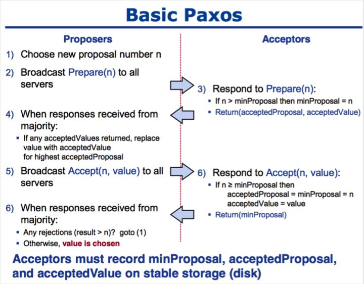
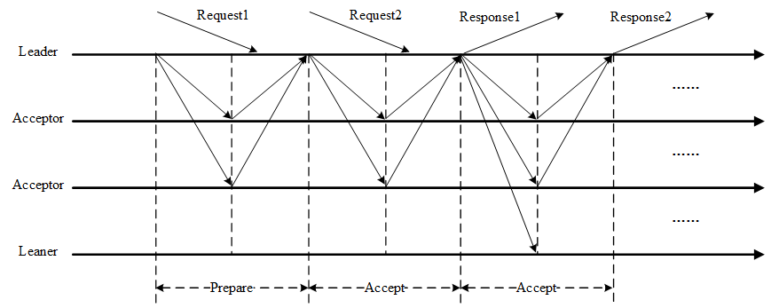
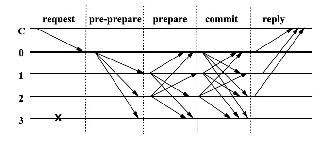

# Paxos

基于消息传递的分布式一致性算法

前置假设：算法运行在允许宕机故障的异步系统中，消息不会被篡改，但可能延迟或丢失

算法中存在三种逻辑角色的节点，在实现中同一节点可以担任多个角色。

- 提案者（Proposer）：提出一个提案，等待大家批准（Chosen）为结案（Value）。系统中提案都拥有一个自增的唯一提案号。往往由客户端担任该角色。
- 接受者（Acceptor）：负责对提案进行投票，接受（Accept）提案。往往由服务端担任。
- 学习者（Learner）：获取批准结果，并帮忙传播，不参与投票过程。

Paxos算法通过一个决议分为两个阶段：

①Prepare阶段：

- Proposer向Acceptors发出Prepare请求，试探是否可以锁定多数接受者的支持。
- 接受者时刻保留收到过提案的最大编号和接受的最大提案。如果收到提案号比目前保留的最大提案号还大，则返回自己已接受的提案值（如果还未接受过任何提案，则为空）给提案者，更新当前最大提案号，并说明不再接受小于最大提案号的提案。

②Accept阶段：

- Proposer收到多数Acceptors承诺的Promise后，则可准备发出带有刚才提案号的接受消息。如果收到的回复中不带有新的提案，说明锁定成功。则使用自己的提案内容；如果返回中有提案内容，则替换提案值为返回中编号最大的提案值。如果没收到足够多的回复，则需要再次发出请求。
- 接受者收到接受消息后，如果发现提案号不小于已接受的最大提案号，则接受该提案，并更新接受的最大提案。

每条消息的描述如下：

- **Prepare**：Proposer生成全局唯一且递增的Proposal ID(可使用时间戳加Server ID)

- **Promise**：Acceptors收到Prepare请求后，做出两个承诺，一个应答

  -  两个承诺：

     1. 不再接收Proposal ID ≤ 当前请求的Prepare请求
     2. 不再接收Proposal ID < 当前请求的Propose请求

  - 一个应答：

    回复已经Accept过的提案中Proposal ID最大的那个提案的value和Proposal ID，没有则返回空值

- **Propose**: Proposer 收到多数Acceptors的Promise应答后，从应答中选择Proposal ID最大的提案作为本次要发起的提案。如果所有应答的提案Value均为空值，则可以自己随意决定提案Value。然后携带当前Proposal ID，向所有Acceptors发送Propose请求。

- **Accept**: Acceptor收到Propose请求后，在不违背自己之前作出的承诺下，接受并持久化当前Proposal ID和提案Value。

- **Learn**: Proposer收到多数Acceptors的Accept后，标志着本次Accept成功，决议形成，将形成的决议发送给所有Learners。

伪码描述：

一个潜在的问题是提案者在提案过程中出现故障，这可以通过超时机制来缓解。极为凑巧的情况下，每次新一轮提案的提案者都恰好故障，又或者两个提案者恰好依次提出更新的提案，则导致活锁(两个Proposers交替Prepare成功，而Accept失败，形成Livelock)，系统会永远无法达成共识（实际发生概率很小）。

**Multi-Paxos**：

首先需要选举Leader，Leader的确定也是一次决议的形成，所以可执行一次Basic Paxos实例来选举出一个Leader。选出Leader之后只能由Leader提交Proposal，在Leader宕机之后服务临时不可用，需要重新选举Leader继续服务。在系统中仅有一个Leader进行Proposal提交的情况下，Prepare阶段可以跳过。

1. 针对每一个要确定的值，运行一次Paxos算法实例（Instance），形成决议。每一个Paxos实例使用唯一的Instance ID标识。
2. 在所有Proposers中选举一个Leader，由Leader唯一地提交Proposal给Acceptors进行表决。这样没有Proposer竞争，解决了活锁问题。在系统中仅有一个Leader进行Value提交的情况下，Prepare阶段就可以跳过，从而将两阶段变为一阶段，提高效率。

# Raft

Raft与Muiti-Paxos中相似的概念：

不同点：

典型的过程包括两个阶段：

- Leader选举：开始所有节点都是Follower， Leader向所有Followers周期性发送heartbeat。如果Follower在选举超时时间内没有收到Leader的heartbeat，就会等待一段随机的时间后发起一次Leader选举。Follower则转变角色为Candidate（中间状态），提出选举请求。Raft算法将时间分为一个个的任期（term），每一个term的开始都是Leader选举，最近选举阶段（Term）中得票超过一半者被选为Leader；拥有最新的已提交的log entry的Follower才有资格成为Leader。在成功选举Leader之后，Leader会在整个term内管理整个集群。如果Leader选举失败，该term就会因为没有Leader而结束，随机超时后进入新的阶段重试。

- 同步日志：Leader选出后，开始从客户端接收请求，把请求作为日志条目（Log entries）加入到它的日志中，并分发到其他节点；Leader会决定系统中最新的日志记录，并强制所有的Follower刷新到这个记录，数据的同步是单向的，确保所有节点看到的视图一致。当这条日志被复制到大多数服务器上，Leader将这条日志应用到它的状态机并向客户端返回执行结果。

在实际的系统中，不能让日志无限增长，否则系统重启时需要花很长的时间进行回放，从而影响可用性。Raft采用对整个系统进行snapshot来解决，snapshot之前的日志都可以丢弃，Snapshot中包含：

- 日志元数据。最后一条已提交的 log entry的 log index和term。这两个值在snapshot之后的第一条log entry的AppendEntries RPC的完整性检查的时候会被用上。
- 系统当前状态。

# PBFT

假如节点总数为 N，故障节点数为 F，则当 3F + 1 ≤ N 时，问题才能有解，由 BFT 算法进行保证，解决的是在网络通信可靠，但节点可能故障和作恶情况下如何达成共识。

PBFT算法采用密码学相关技术（RSA 签名算法、消息验证编码和摘要）确保消息传递过程无法被篡改和破坏。算法整体的基本过程如下：

- 首先，通过轮换或随机算法选出某个节点为主节点，此后只要主节点不切换，则称为一个视图（View）。
- 在某个视图中，客户端将请求 `<REQUEST,operation,timestamp,client>` 发送给主节点，主节点负责广播请求到所有其它副本节点。
- 所有节点处理完成请求，将处理结果 `<REPLY,view,timestamp,client,id_node,response>` 返回给客户端。客户端检查是否收到了至少 **f+1** 个来自不同节点的相同结果，作为最终结果。

主节点广播过程包括三个阶段共识过程：

1. Pre-prepare 阶段：节点收到 pre-prepare 消息后，会有两种选择，一种是接受，一种是不接受。什么时候才不接受主节点发来的 pre-prepare 消息呢？一种典型的情况就是如果一个节点接受到了一条 pre-pre 消息，消息里的 v 和 n 在之前收到里的消息是曾经出现过的，但是 d 和 m 却和之前的消息不一致，或者请求编号不在高低水位之间（高低水位的概念在下文会进行解释），这时候就会拒绝请求。拒绝的逻辑就是主节点不会发送两条具有相同的 v 和 n ，但 d 和 m 却不同的消息。
2. Prepare 阶段：节点同意请求后会向其它节点发送 prepare 消息。这里要注意一点，同一时刻不是只有一个节点在进行这个过程，可能有 n 个节点也在进行这个过程。因此节点是有可能收到其它节点发送的 prepare 消息的。在一定时间范围内，如果收到超过 2f 个不同节点的 prepare 消息，就代表 prepare 阶段已经完成。
3. Commit 阶段：于是进入 commit 阶段。向其它节点广播 commit 消息，同理，这个过程可能是有 n 个节点也在进行的。因此可能会收到其它节点发过来的 commit 消息，当收到 2f+1 个 commit 消息后（包括自己），代表大多数节点已经进入 commit 阶段，这一阶段已经达成共识，于是节点就会执行请求，写入数据。

# Tendermint

# Algorand