# 01-课程简介

# 02-BTC-密码学原理

Crypto-currency

①Cryptographic hash function

性质1和2结合以实现--->digital commitment(digital equivalent of a sealed envelope)

性质1.collision resistance，用来对message求digest，检测数据是否被篡改，btute force工作量很大

性质2.hiding，哈希函数的计算过程是单向不可逆的，从哈希值无法反推输入，哈希值不会泄露输入的信息；要求输入空间要足够大，分布也足够均匀，使蛮力求解不可行

3.puzzle friendly，输出无法预测（挖矿的过程没有捷径，只能靠不停地去试大量的nonce找到合法的解，这个过程作为proof of work）

H（x||nonce），除了原数据外再加上一个随机数作为哈希函数的输入,来保证输入足够随机

H（block header） <= target

difficult to slove，but easy to verify，挖矿很难，验证很容易

比特币使用的哈希函数：SHA-256（Secure Hash Algorithm）

②Signature

(public key，private key)比特币开户就是创立一个公私钥对，随机数生成器生成私钥->通过私钥创建公钥->通过公钥创建账户地址(2次哈希)

公钥相当于银行账号，私钥相当于密码；公私钥来源与非对称加密体系（asymmetric encryption algorithm），密钥的分发是对称加密体系的弱点

**数字签名**：用户发送文件时，用私钥对文件加密，即签名，别人用他公开的公钥解密，签名用私钥，验证用公钥，可以保证该信息是由他发送的；因此可以验证发送方的身份并帮助保护数据的完整性；比特币系统一般对一个message取哈希值，然后再对这个哈希值签名

# 03-BTC-数据结构

### ①Block chain

- Block chain is a linked list using **hash pointers**

  无环的结构都能使用哈希指针

- tamper-evident log

  不管在哪个区块做了改动都会导致最后一个哈希指针发生变化（牵一发而动全身）

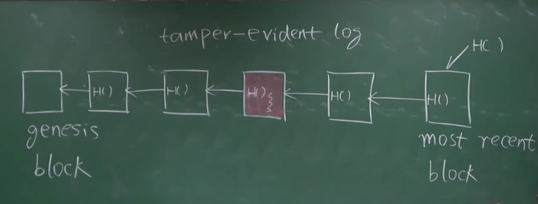

### ②Merkle tree

只要保存root hash就能检测对树中任何部位的修改

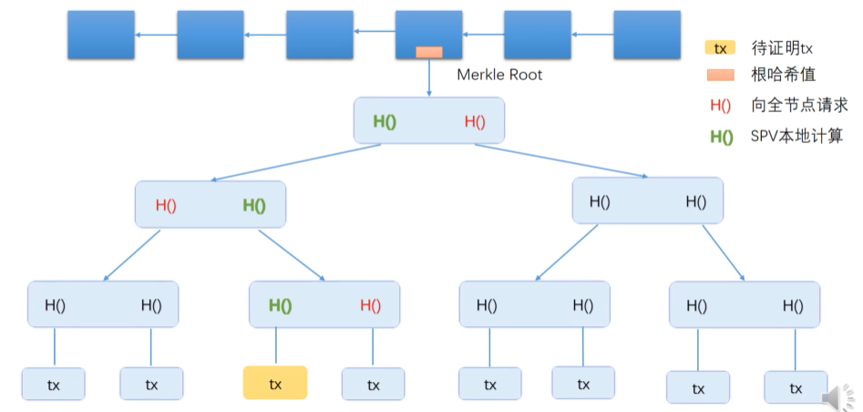

作用：提供Merkle proof

比特币中的节点分为两类：全节点（保存整个区块的内容，包括块头块身，有交易的具体信息），轻节点（只有块头）全节点保存区块链的所有的信息，验证每一个交易，轻节点没有参与区块链的构造和维护，只是利用了区块链的信息做一些查询

全节点可以向轻节点证明Merkle tree里面包含了某个交易，又叫proof of membership或proof of inclusion，T(n)=O(log(n))，如果某个轻节点想知道某个交易是否包含在merkle tree里面，需要向一个全节点发出请求，根据全节点提供的哈希值从下往上验证

# 04-BTC-共识协议

### 去中心化货币要解决两个问题

#### ①怎样发行货币

挖矿机制，初始每发布一个区块产生50BTC(coinbase transaction)，平均出块时间10分钟，21万个区块(大约4年)后奖励减半，

#### ②怎么验证交易的有效性

防范dsa 

每个交易都包含输入和输出两部分，输入部分要说明币的来源(hash指针指向前面某个交易)，通过A的输入脚本和前面交易的输出脚本验证

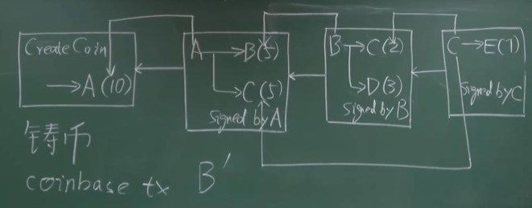

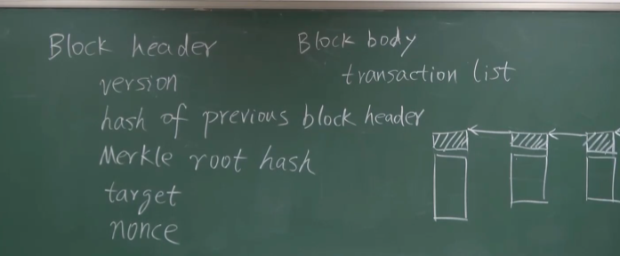

### 比特币的共识机制—POW

1. 全网广播新的交易，**通过合法性验证**的被暂存，各节点维护候选区块
2. 挖矿，寻找合适的nonce，使H(block header)≤target
3. 率先找到nonce的节点获得记账权，其打包的区块上传至区块链中
4. 对外广播新区块，其他节点验证通过后，将其添加至链中

- 挖矿原理

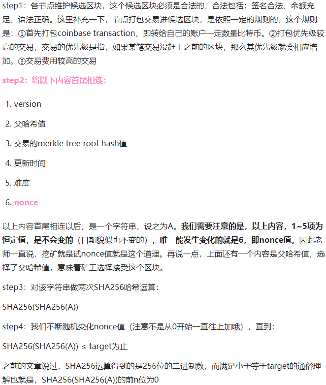

# 05-BTC-实现

### transaction-based ledger

为了快速检测double spending，全节点要在内存中维护UTXO(Unspent Transaction Output)集合，表示还没有被花掉的交易的输出集合，该集合中的每个元素要给出**产生这个输出的交易的哈希值以及它在这个交易里是第几个输出**

- total inputs = total outputs

  铸币交易没有输入，它有一个coinbase域可以写入，若修改了它的域，**根哈希值**会发生变化，因此coinbase域的前八个字节可以当作extra nonce来用

- progress free

  将来还要挖多长时间，跟过去已经挖了多长时间是没有关系的

- 比特币总量

  21万 x 50BTC x （1+1/2+1/4+……)=2100万

- Bitcoin is secured by mining 

# 06-BTC-网络

simple，robust，but not efficent 

比特币工作在应用层(application layer)，运行Bitcoin Block chain

底层是网络层(network layer)，运行P2P Overlay Network，节点之间通过TCP通信，所有节点平等

消息传播采用**flooding**，收到消息后传播给邻居节点，重复的消息不传播

每个节点要维护一个等待上链的交易的集合，如果节点监听到了一个交易就将其写入集合（DSA不写入）

# 07-BTC-挖矿难度调整

为保证平均出块时间10分钟，2016个区块后调整一次难度，大约两周

target = target * autual time/expected time，nBits是target一个编码的版本

# 08-BTC-挖矿

挖矿设备专业化：CPU——GPU——ASIC

Alternative mining puzzle，目的是让通用的计算机也能参与挖矿的过程

mining pool：将许多矿工组织起来作为一个整体

coinbase域中有8bytes作为extra nonce

# 09-BTC-比特币脚本

stack-based language

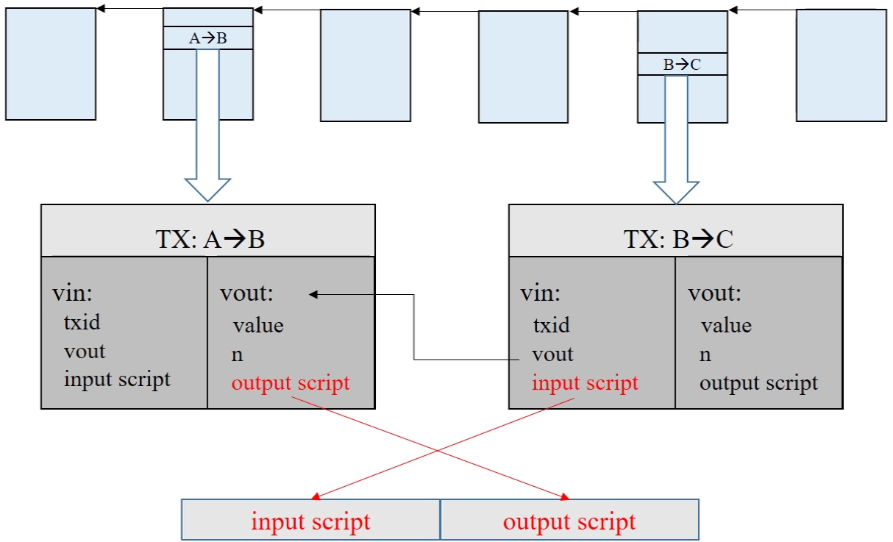

早期将输入和输出脚本拼接在一起执行，验证交易的合法性，后出于安全考虑分别执行，若执行完后栈顶元素为非0值(true)，则交易是合法的

### P2PK

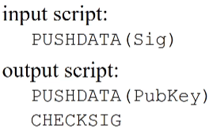

输入脚本里给出签名（签名是用私钥对输入脚本所在的**整个交易**的签名）

输出脚本给出收款人公钥

### P2PKH

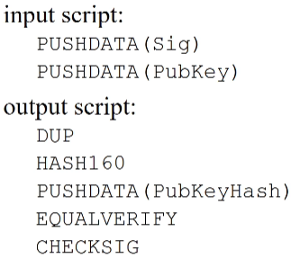

输入脚本给出签名和公钥

输出脚本给出收款人公钥的哈希

### P2SH

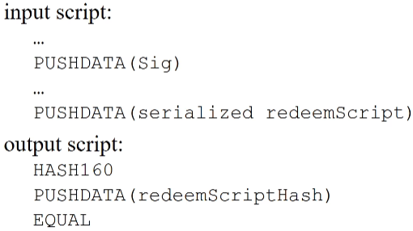

输入脚本给出序列化的赎回脚本和让赎回脚本正确运行所需要的的签名(数目不定)

输出脚本给出收款人提供的赎回脚本的哈希

- 用P2SH实现P2PK

- 用P2SH实现多重签名，本质是将复杂度从输出脚本转移到了输入脚本

  早期用CHECKMULTISIG使输出脚本不方便

### Proof of Burn

output script RETURN

两个应用场景：销毁币，或写入一些内容

写入内容也可以写在cionbase域里面，但这个方法只有获得记账权的节点才能用，但return方法所有人都能用，因为发布交易不需要有记账权，发布区块才需要有记账权

# 10-BTC-分叉

### state fork

1. 对当前的状态产生分歧
2. forking attack(deliberate fork)

### protocol fork

对协议产生了分歧，针对协议修改的不同的内容进一步分成：

#### hard fork

对比特币增加一些新的特性，扩展一些新的功能，旧节点不认可，产生了永久性分叉，如block size limit （十分钟一个区块(1M)只包含了4000个交易） 

#### soft fork

对协议增加一些限制，原来合法的区块在新的协议当中不合法了，产生临时性分叉，旧节点如果不更新，挖的区块会一直失被回滚 ；著名的软分叉例子：P2SH

# 11-BTC-问答

# 12-BTC-匿名性

一个人可以生成多个地址账户，但这些地址账户有可能被关联起来 

得到匿名性的常用做法：coin mixing，

### 零知识证明

zero-knowledge-proof：证明者向验证者证明一个陈述是正确的，而无需透露该陈述是正确的外的任何信息

### 同态隐藏

# 13-BTC-思考

哈希指针只有哈希没有指针，（key，value），通过key（哈希值）在levelDB里查找区块的值

多个人的共享账户不能用截断私钥的办法，应使用多重签名MULTISIG

# 14-ETH-以太坊概述

改进：

- 出块时间大幅减少，缩至10多秒
- ghost共识机制

- memory-hard mining puzzle --- ASIC resistance

- 将来希望改变：pow ---> pos

- 支持smart contract（decentralized contract）

# 15-ETH-账户

account-based ledger

对 dsa 有天然的防御作用，但存在replay attack(重放攻击)由收款人发起，解决方法是加一个nonce(账户的交易次数编号)，作为交易的内容受**签名**的保护

账户类型:

- Externally owned account

  外部账户，由公私钥控制，类似于比特币中的账户，包含balance和nonce

  `1 ether = 10^18 wei`

- Smart contract account

  合约账户，不通过公私钥控制，不能主动发起交易
  
  包含balance、nonce、code以及相关的storage(状态)

外部账户的地址是由公钥决定的，合约账户的地址是在创建该合约时确定的，通过合约创建者的地址和从该地址发出过的交易数量(也就是"nonce")计算得到

***为什么改变？***

比特币可以经常更换账户，隐私性好；合约需要比较稳定的账户参与

# 16-ETH-状态树

完成addr(20B)到state的映射

trie -- Patricia tree -- Merkle Patricia tree -- Modefied MPT
- merkle proof: 可以根据键值从顶向下查找，证明某个账户的余额，也可以证明某个账户不能存在
- 每个区块的状态树的大部分结点是共享的，发生改变的结点需要新建一个分支，要保留历史状态，为了支持智能合约的回滚
- value经过序列化后再存储，protobuf

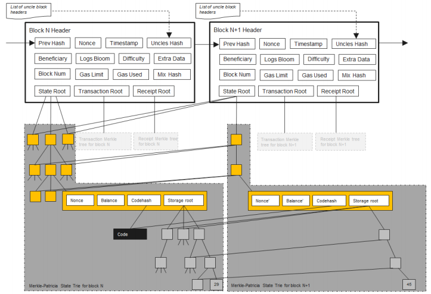

# 17-ETH-交易树和收据树

发布新区块时区块中的交易组成交易树，每个交易执行完会形成一个收据，记录该交易的相关信息，每个区块的交易树和收据树是独立的

- 作用：提供Merkel proof，支持查找过去10天和某个智能合约相关的交易
- bloom filter，查找时能过滤掉大量无关的区块，先查找区块的bloom filter是否有需要的交易，如果有再查找收据的bloom filter

- transaction-driven state machine (UTXO是BTC的state)

# 18-ETH-GHOST协议

- 解决临时性分叉
- 分叉的第一个区块获得uncle award

# 19-ETH-以太坊的挖矿算法

ASIC resistance，memory hard mining puzzle

ethash，16M cache，1G dataset(DAG)

从cache中按伪随机顺序读256个数，算出结果作为DAG的一个元素，生成DAG后再按伪随机顺序(根据nonce)从DAG中读取128个数(64次循环每次读相邻的两个数)，算出哈希值检查是否符合难度要求

轻节点验证nonce时通过cache临时计算出需要的DAG中的元素

# 20-ETH-难度调整

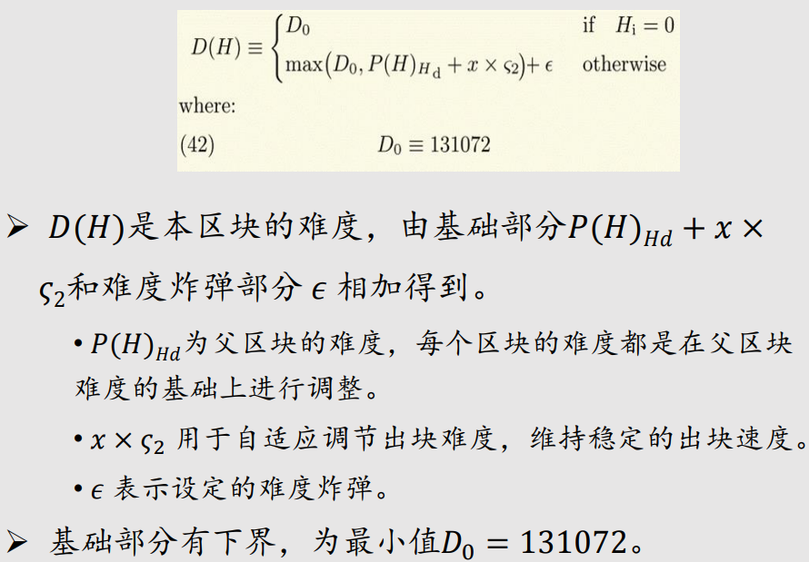

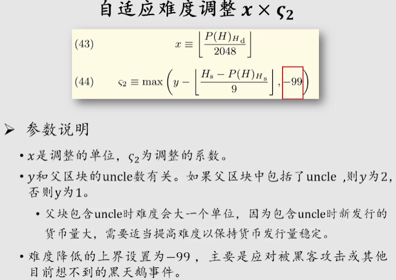

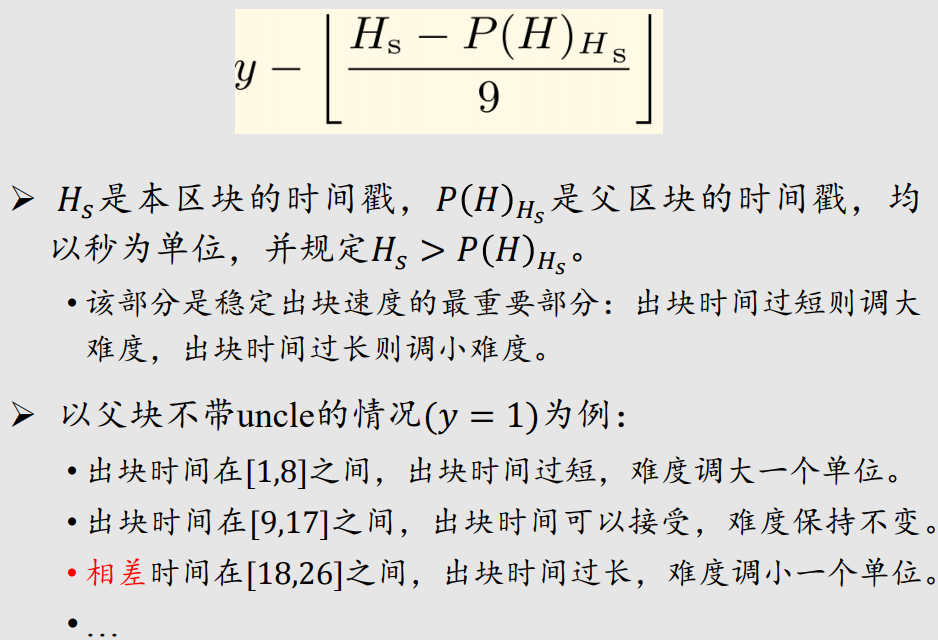

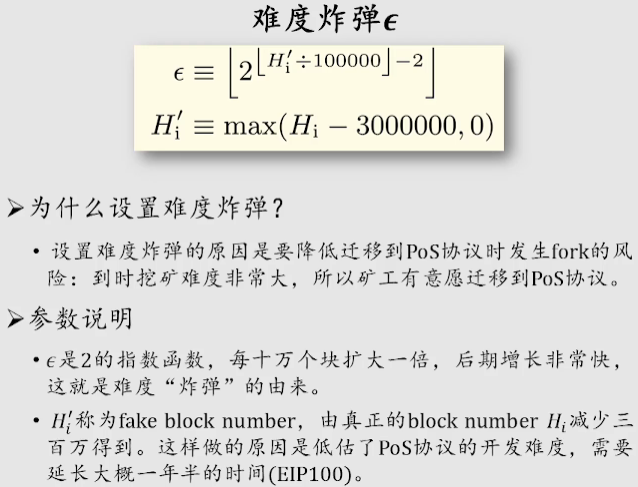

# 21-ETH-权益证明

Casper the Friendly Finality Gadget

过渡阶段与工作量证明混合使用，为工作量证明提供Finality

每挖出50个区块生成一个epoch，进行two-phase commit

引入Validator(验证者)，投入一定数量的保证金，连续两个epoch都要有2/3验证者支持才算通过

# 22-ETH-智能合约

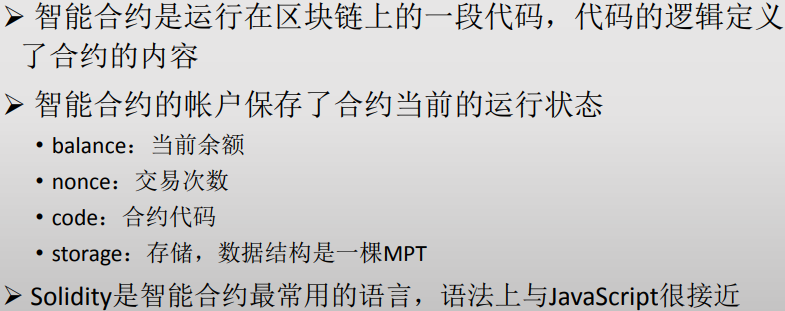

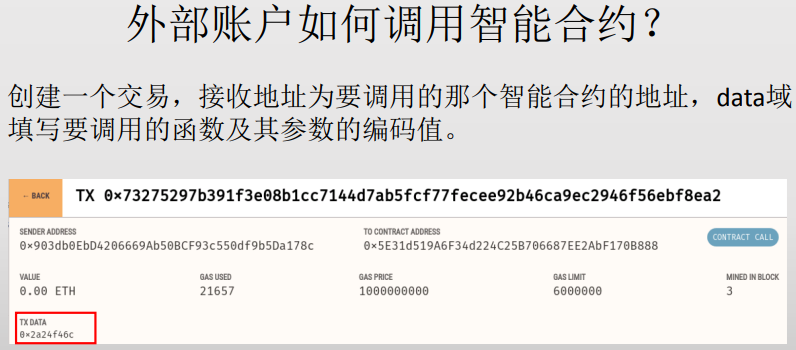

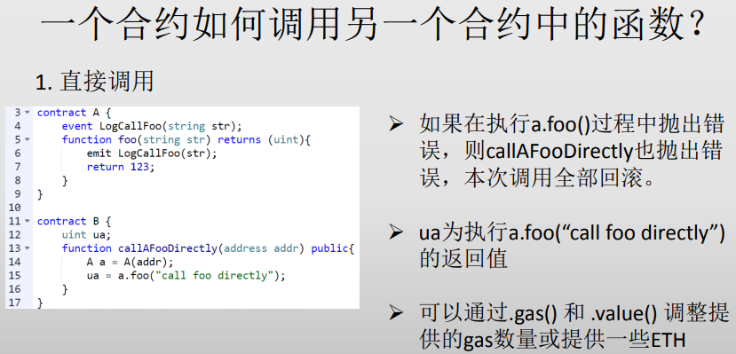

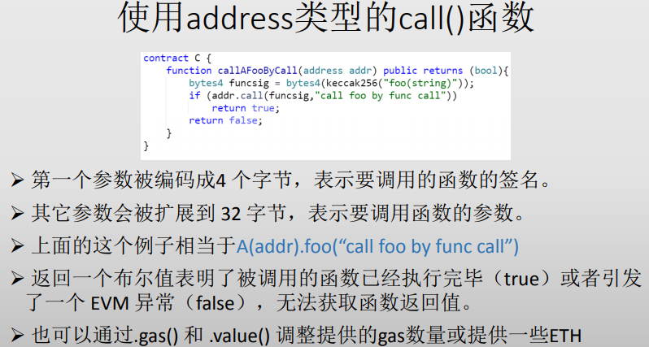

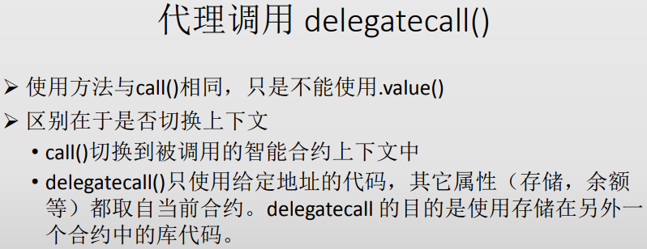

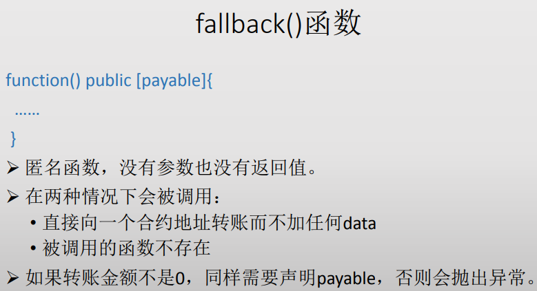

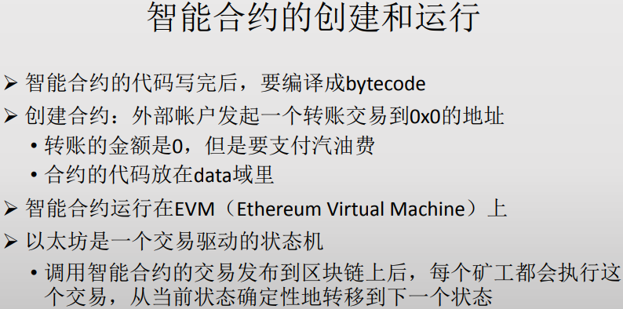

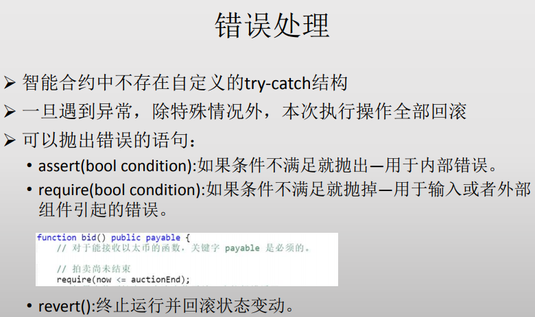

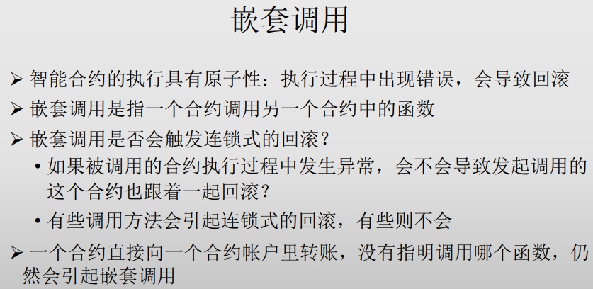

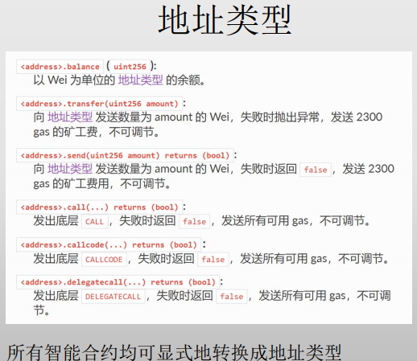

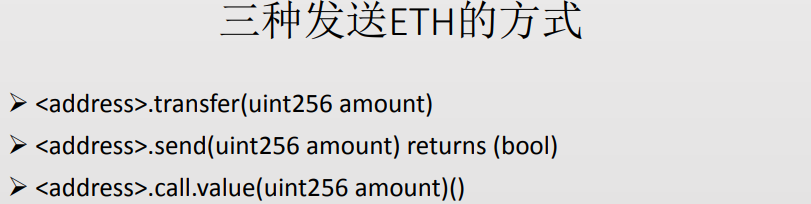

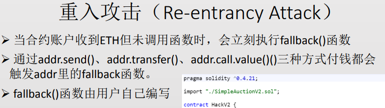

***code is law***

# 23-ETH-TheDAO

Decentralized Autonomous Organization

# 24-ETH-反思

Is smart contract really smart? 代码合同

Irrevocability is a double edged sword.

Noting is irrevocable.

Is solidity the right programming language?

合约模板

What does decentralization mean?

state machine不是为了加速，而是为了容错

# 25-ETH-美链

Beauty Chain

ICO: Initial Coin Offering

IPO: Initial Public Offering

SafeMath库

# 26-总结