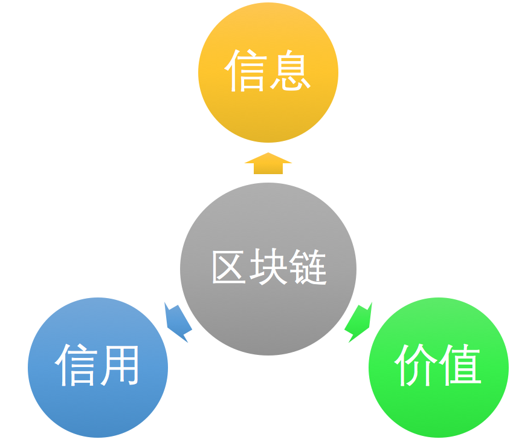
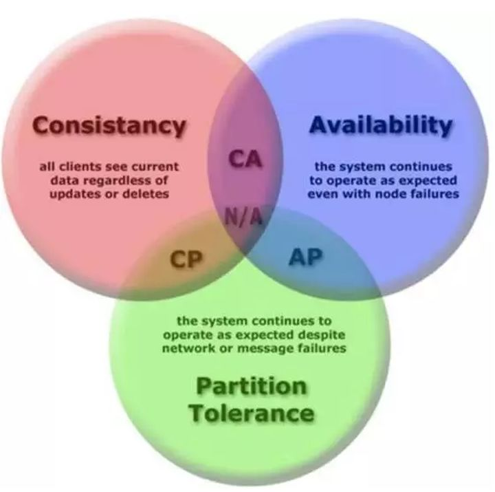
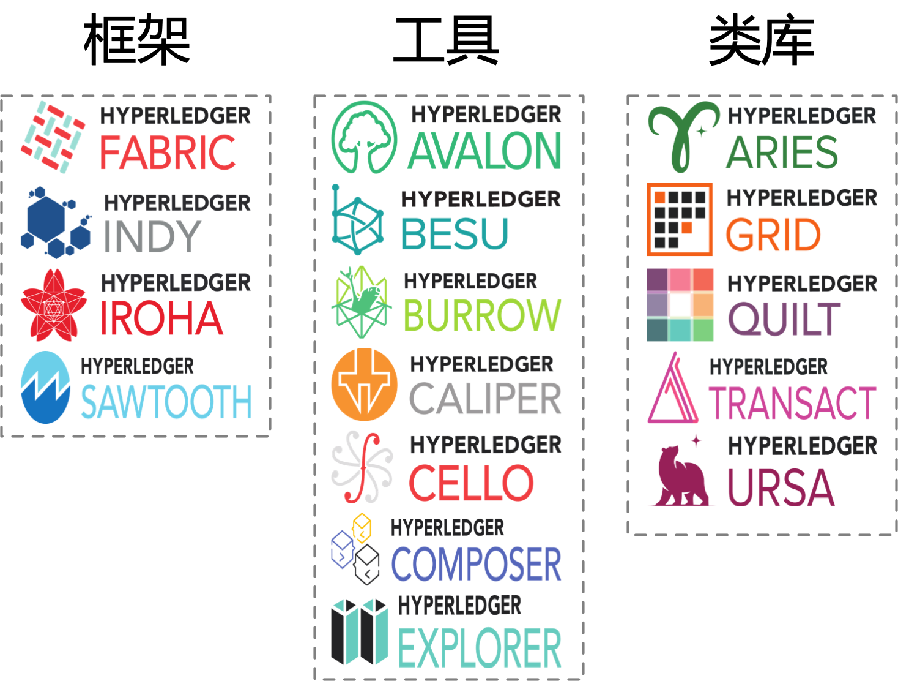

# 前言

Blockchain是Fintech领域的一项基础性创新，是新一代Distributed Ledger Technology（DLT）系统的核心技术，涉及分布式系统、密码学、博弈论、网络协议等学科知识

# 区块链的诞生

记账问题发展到分布式场景下的天然结果

## 记账的千年演化

阶段一：单式账本，通过单条记录进行账目记录，也称简单记账

阶段二：复式账本，将每笔交易分别在贷方(来源方)和借方(目标方)两个科目进行记录，且借贷双方的总额应该时刻保持相等

阶段三：数字化账本，使用数字媒介记账

阶段四：分布式账本，由交易多方共同维护同一个共享的分布式账本

## 分布式记账与区块链

方案一：简单分布式记账结构，多方均允许对账本进行任意读写，无法确保账本记录的正确性

方案二：带有数字摘要验证的分布式记账，Digital Digest技术，防止交易被篡改，当存在大量交易历史时计算成本将变得很高

方案三：带有数字摘要验证的可扩展的分布式账本，计算摘要改进为对旧的摘要值再加上新的交易内容进行验证

## 比特币的出现

首次从实践意义上实现了安全可靠的非中心化数字货币机制：

不需要中心化的支持机构参与，纯靠分布式机制

准确、公正地记录发生过的每一笔交易，并且无法被恶意篡改

匿名化交易，保证隐私

## 区块链的商业价值

技术角度：分布式容错性高、不可篡改性、隐私保护性

业务特性：可信任性、降低成本、增强安全

所有跟信息、价值（包括货币、证券、专利、版权、数字商品、实际物品等）、信用等相关的交换过程，都将可能从区块链技术中得到启发或直接受益



# 核心技术概览

## 定义与原理

**Wikipedia**上给出的定义中，将区块链类比为一种分布式数据库技术，通过维护数据块的链式结构，可以维持持续增长的、不可篡改的数据记录。

## 技术的演化与分类


根据参与者的不同，可以分为公有（Public 或 Permissionless）链、联盟（Consortium 或 Permissioned）链和私有（Private）链。

## 关键问题和挑战

①隐私保护：分布式账本要在共享协同信息和隐私保护之间达到合适的平衡，一些领域需要有机结合零知识证明、同态加密等新的密码学手段

②分布式共识：比特币引入的pow的核心思想是基于经济利益的博弈，让恶意破坏的参与者损失经济利益，从而保证大部分人的合作，并通过概率模型保证最后参与方共识到最长链，问题在于效率的低下和能源的浪费

③交易性能：区块链在高频交易的场景不适用，离大规模交易系统每秒稳定数万笔的吞吐性能还有较大差距

④扩展性：当网络中节点数过多时，可能会因为共识延迟而降低整个网络的性能，要解决这个问题，根本上是放松对每个节点都必须参与完整处理的限制

⑤安全防护：传统的网络安全（认证、过滤、攻防）、信息安全（密码配置、密钥管理）、管理安全（审计、风险分析控制）等问题；立法，对区块链系统如何进行监管；代码实现的漏洞管理；交易记录公开可见，即便被匿名化和加密处理也可能被破解；智能合约可能存在的漏洞。

⑥数据库和存储系统：需要设计专门服务区块链的更具针对性的数据库

# 分布式系统核心技术

## 一致性问题

Consistency

- 在分布式系统领域中是指对于多个服务节点，给定一系列操作，在约定协议的保障下，使得它们对处理结果达成“某种程度”的协同

核心思想

- 将可能引发不一致的并行操作进行**串行化**

## 共识算法

一致性指的是多个副本对外呈现的状态，而共识则指在分布式系统中多个节点之间对某个事件达成一致看法的过程，达成某种共识并不意味着就保障了一致性。

State Machine Replication

- 分布式系统中各个节点通常都是相同的确定性状态机模型（又称为状态机复制问题），从相同初始状态开始接收相同顺序的指令，则可以保证相同的结果状态。因此，系统中多个节点最关键地是对多个事件的顺序进行共识，即排序。

Non-Byzantine Fault（Crash Fault）

根据解决的场景是否允许拜占庭错误情况，共识算法分为

- CFT（Paxos、Raft）
- BFT（PBFT、PoW）

## FLP不可能原理

在网络可靠，但**允许节点失效**（即便只有一个）的最小化**异步**模型系统中，不存在一个可以解决一致性问题的确定性共识算法

- 同步，指系统中的各个节点的时钟误差存在上限；并且消息传递必须在一定时间内完成，否则认为失败；同时各个节点完成处理消息的时间是一定的。因此同步系统中可以很容易地判断消息是否丢失。
- 异步，则意味着系统中各个节点可能存在较大的时钟差异；同时消息传输时间是任意长的；各节点对消息进行处理的时间也可能是任意长的。这就造成无法判断某个消息迟迟没有被响应是哪里出了问题（节点故障还是传输故障？）。

## CAP原理



## ACID原则与多阶段提交

ACID原则描述了分布式数据库需要满足的一致性需求，同时允许付出可用性的代价

- Atomicity：每次事务是原子的，事务包含的所有操作要么全部成功，要么全部不执行。一旦有操作失败，则需要回退状态到执行事务之前；
- Consistency：数据库的状态在事务执行前后的状态是一致的和完整的，无中间状态。即只能处于成功事务提交后的状态；
- Isolation：各种事务可以并发执行，但彼此之间互相不影响。按照标准 SQL 规范，从弱到强可以分为未授权读取、授权读取、可重复读取和串行化四种隔离等级；
- Durability：状态的改变是持久的，不会失效。一旦某个事务提交，则它造成的状态变更就是永久性的。

两阶段提交：

- 预提交：协调者（Coordinator）发起提交某个事务的申请，各参与执行者（Participant）需要尝试进行提交并反馈是否能完成；
- 正式提交：协调者如果得到所有执行者的成功答复，则发出正式提交请求。如果成功完成，则算法执行成功。

三阶段将预提交阶段进一步拆分：

- 尝试预提交：协调者询问执行者是否能进行某个事务的提交。执行者需要返回答复，但无需执行提交。这就避免出现部分执行者被无效阻塞住的情况。
- 预提交：协调者检查收集到的答复，如果全部为真，则发起提交事务请求。各参与执行者（Participant）需要尝试进行提交并反馈是否能完成；
- 正式提交：协调者如果得到所有执行者的成功答复，则发出正式提交请求。如果成功完成，则算法执行成功。

## Paxos算法与Raft算法

## 拜占庭问题与PBFT算法

[共识算法]: ./ConsensusAlgorithm.md

## 可靠性指标

“几个 9”的指标：衡量每年允许服务出现的不可用时间

MTBF：Mean Time Between Failures，平均故障间隔时间，即系统可以无故障运行的预期时间。

MTTR：Mean Time To Repair，平均修复时间，即发生故障后，系统可以恢复到正常运行的预期时间。

# 密码学与安全技术

主要用于身份认证和隐私保护

## Hash算法与数字摘要

将任意长度的二进制明文串映射为较短的（通常是固定长度的）二进制串

常见的Hash算法：Message Digest（MD）和Secure Hash Algorithm（SHA），以及国内SM3

数字摘要对原始数字内容进行Hash运算获取唯一的摘要值，Hash算法不是一种加密算法不能用于对信息的保护

采用加盐（Salt）的方法，保存原文再加上一段随机字符串（即“盐”）之后的 Hash 值。Hash 结果和“盐”分别存放在不同的地方，只要不是两者同时泄露，攻击者很难进行破解。

## 加解密算法

加解密系统的典型组件包括算法和密钥(包括加密密钥、解密密钥)，加解密算法自身是固定不变的，一般来说密钥需要在加密前按照特定算法随机生成


非对称加密算法：代表算法包括RSA、ElGamal、ECC、SM2

混合加密机制：先用非对称加密（计算复杂度较高）协商出一个临时的对称加密密钥（或称会话密钥），然后双方再通过对称加密算法（计算复杂度较低）对所传递的大量数据进行快速的加密处理。典型的应用案例安全超文本传输协议（Hyper Text Transfer Protocol Secure，HTTPS）。

## 消息认证码与数字签名

***消息认证码和数字签名***技术通过对消息的摘要进行加密，可以防止消息被篡改和认证身份

消息认证码（Hash-based Message Authentication Code，HMAC），利用对称加密，对消息完整性（Integrity）进行保护。包括 K，H，M 三个参数。K 为提前共享的对称密钥，H 为提前商定的 Hash 算法（如 SHA-256），M 为要传输的消息内容。

数字签名：证明消息是某个特定的人发送的，用私钥加密的消息称为签名，用公钥解密签名称为验证签名，一般对消息的哈希值进行签名

例：Alice 先对文件内容进行摘要，然后用自己的私钥对摘要进行加密（签名），之后同时将**文件和签名**都发给 Bob。Bob 收到文件和签名后，用 Alice 的公钥来解密签名，得到数字摘要，与对文件进行摘要后的结果进行比对。如果一致，说明该文件确实是 Alice 发过来的（因为别人无法拥有 Alice 的私钥），并且文件内容没有被修改过（摘要结果一致）。目前常见的数字签名算法需要选取合适的随机数作为配置参数

盲签名：签名者在无法看到原始内容的前提下对信息进行签名，实现对所签名内容的保护，防止签名者看到原始内容

## 数字证书

对于非对称加密算法和数字签名来说，很重要的步骤就是**公钥的分发**

证书：**认证机构**（Certification Authority，CA）对公钥进行数字签名，能够**证明某个公钥是某个实体拥有**，从而实现对用户公钥的安全分发

证书格式：证书文件的后缀一般为.ctr或.cer，对应私钥文件后缀为.key

要实现安全地管理、分发证书需要遵循**PKI**（Public Key Infrastructure）体系

用户可以使用开源软件openssl来生成csr文件(证书申请文件)和对应的私钥文件

## Merkle树结构

叶节点包含数据或其哈希值，非叶子节点是孩子节点内容的哈希值，数根的值代表对底层所有数据的“数字摘要”

应用场景：

- 证明某个集合中存在或不存在某个元素

  提供该元素各级兄弟节点中的Hash值，可以不暴露集合完整内容而证明某元素存在

  对于可以进行排序的集合，可以将不存在元素的位置用空值代替，以此构建稀疏默克尔树（Sparse Merkle Tree），可以证明某个集合中不包括指定元素。

- 快速比较大量数据

  两个Merkle tree根相同时，意味两组数据必然相同

  若对每组数据排序后构建默克尔树结构，树根不同则数据不同

- 快速定位修改

  若Root 的数值发生变化，沿着 Root --> N4 --> ... --> N1，最多通过 O(logN) 时间即可快速定位到实际发生改变的数据块

## Bloom Filter结构

普通的Hash快速查找(内容->索引)，当映射后的值限定在一定范围内时，Hash冲突的概率会变高，存储系统又不能无限扩展

布隆过滤器是一种基于 Hash 的高效查找结构，能够快速（常数时间内）回答“某个元素是否在一个集合内”的问题

对同一个输入，使用多个Hash函数计算出多个地址，分别在位串的这些地址上标记为1，查找时进行同样的计算过程，如果都为1则说明大概率存在该输入

## 同态加密

可以保证加密处理者无法访问到数据自身的信息

即对密文直接进行处理和对明文进行处理后再对处理结果加密，得到的结果相同，从抽象代数的角度讲保持了同态性

## 零知识证明

证明者在不向验证者提供所证明信息之外的任何信息的前提下，使验证者相信某个论断（Statement）是正确的

## 可验证随机函数

Verifiable Random Function，一类特殊的伪随机函数，结合了非对称密钥技术的哈希函数

# 比特币--区块链思想诞生的摇篮

## 项目简介

2008年，中本聪发布比特币白皮书，2009中本聪挖出首批50个BTC

2012年，单个区块产生的比特币从 50 个减半到 25 个

## 基本原理和设计

比特币采用了 UTXO (Unspent Transaction Outputs)模型，相对于账户模型，UTXO 模型可以更容易实现并行处理和隐私保护，并追踪完整交易路径；但由于需要存储和检索所有交易记录，对节点存储压力较大

- 账户/地址

  账户地址用户公钥经过一系列 Hash及编码运算后生成的 160 位（20 字节）的字符串

- 交易

  一条交易包含的信息：

  - 付款人地址：合法的地址
  - 付款人对交易的签字确认：确保交易内容不被篡改
  - 付款人资金的来源交易 ID：从哪个交易的输出作为本次交易的输入
  - 交易的金额：和输入的差额为交易的服务费；（比特币最小单位是“聪”，即 10^(-8) 比特币）
  - 收款人地址：合法的地址
  - 时间戳：交易何时能生效

- 交易脚本

  主要用于检测交易是否合法的核心机制，包括负责输入的解锁脚本（scriptSig）和负责输出的锁定脚本（scriptPubkey）

  付款方证明自己所引用的UTXO合法通过输入脚本来实现，并且指定输出脚本来限制将来能使用新UTXO者只能为指定收款方

  输出脚本的类型：

  - P2PKH：输出脚本里给出收款人公钥的哈希，输入脚本给出签名和公钥
  - P2SH：输出脚本包含另一个脚本（认领脚本）的哈希

- 区块

  主要包括：

  - 区块大小：4 字节，一个区块不能超过 1 MB
  - 区块头：80 字节
  - 交易个数计数器：1~9 字节
  - 所有交易的具体内容，可变长

  区块头：

  - 版本号：4 字节
  - 上一个区块头的 Hash 值：链接到上一个合法的块上，对其区块头进行两次 SHA256 操作，32 字节
  - 时间戳：4 字节
  - 难度指标：4 字节
  - Nonce：4 字节
  - 本区块所包含的所有交易的 Merkle 树的根哈希值：两次 SHA256 操作，32 字节


- 如何避免作恶

  基于经济博弈原理让合作者得到利益，让非合作者遭受风险和损失

- 负反馈调节

  比特币网络中，矿工越多，系统就越稳定，挖到矿的概率会降低，比特币价值越高

  矿工减少，会让系统更容易导致被攻击，挖到矿的概率会提高，比特币价值越低

## 闪电网络

将大量交易放到比特币区块链之外进行，只把关键环节放到链上进行确认，主要通过引入智能合约的思想来完善链下的交易渠道

- RSMC(Recoverable Sequence Maturity Contract，序列到期可撤销合约)，解决了链下交易的确认问题

  首先假定交易双方之间存在一个“微支付通道”（资金池）。交易双方先预存一部分资金到“微支付通道”里，每次发生交易，需要对交易后产生资金分配结果共同进行确认，同时签字把旧版本的分配方案作废掉。任何一方需要提现时，将他手里双方签署过的交易结果写到区块链网络中，从而被确认。整个过程只有在提现时候才需要通过区块链，可以实现大量中间交易发生在链外。

- HTLC(Hashed Timelock Contract，哈希时间锁定合约)，解决了支付通道的问题

  加入“时间限制”和“强制执行交易”的机制，使得交易各方无法在合约签订后私自中断合约交易，从而在RSMC的基础上构建出了一张快捷支付的安全网络。

## 侧链

以比特币作为主链，其他区块链作为侧链，二者通过双向挂钩，实现比特币从主链转移到侧链进行流通，侧链的核心原理在于能够冻结一条链上的资产，然后在另一条链上产生

## 分叉

比特币区块链在升级时可能发生分叉，据新旧节点相互兼容性上的区别，可分为软分叉和硬分叉

- Soft Fork：旧节点仍然能够验证接受新节点产生的交易和区块


- Hard Fork：旧节点不接受新节点产生的交易和区块


# 以太坊--挣脱加密货币的枷锁

## 项目简介

跟比特币项目相比，以太坊区块链的技术特点主要包括：

- 支持图灵完备的智能合约，设计了编程语言 Solidity 和虚拟机 EVM
- 选用了内存需求较高的哈希函数，避免出现强算力矿机、矿池攻击
- 减少区块产生间隔（10 分钟降低到 15 秒左右）
- Uncle Block 激励机制
- 采用账户系统和世界状态，而不是 UTXO，容易支持更复杂的逻辑
- 通过 Gas 限制代码执行指令数，避免循环执行攻击
- 支持 PoW 共识算法，并计划支持效率更高的 PoS 算法

## 核心概念

- Smart Contract

  即以计算机程序的方式来缔结和运行各种合约，智能合约作为运行在以太坊虚拟机EVM中的应用，可以接受来自外部的交易请求和事件，通过触发运行提前编写好的代码逻辑，进一步生成新的交易和事件，可以进一步调用其它智能合约。智能合约的执行结果可能对以太坊网络上的账本状态进行更新

- 账户

  Externally Owned Accounts：以太币拥有者账户，对应到某公钥。账户包括 nonce、balance、storageRoot、codeHash 等字段，由个人来控制。

  Contracts Accounts：存储执行的智能合约代码，只能被外部账户来调用激活；

  当合约被调用时，存储其中的智能合约会在矿工处的虚拟机中自动执行，并消耗一定的燃料。燃料通过外部账户中的以太币进行购买。

- 交易

  指一个账户到另一个账户的消息数据，消息数据可以是以太币或者合约执行参数

  以太坊采用交易作为执行操作的最小单位。每个交易包括如下字段：

  - to：目标账户地址。
  - value：可以指定转移的以太币数量。
  - nonce：交易相关的字串，用于防止交易被重放。
  - gasPrice：执行交易需要消耗的 Gas 价格。
  - gasLimit：交易消耗的最大 Gas 值。
  - data: 交易附带字节码信息，可用于创建/调用智能合约。
  - signature：签名信息。

- 以太币

  Ether，主要用于购买燃料，支付给矿工，以维护以太坊网络运行智能合约的费用，一个以太币等于 10^18 个 wei。

- 燃料

  Gas，控制某次交易执行指令的上限，每执行一条合约指令会消耗固定的燃料，当某个交易还未执行结束，而燃料消耗完时，合约执行终止并回滚状态

## 主要设计

- 智能合约相关设计

  EVM是一个隔离的轻量级虚拟机环境，运行在其中的智能合约代码无法访问本地网络、文件系统或其它进程

  合约编写完毕后，用编译器编译为EVM专用的二进制格式（EVM bytecode），由客户端上传到区块链当中，之后在矿工的EVM中执行

- 交易模型


- 共识

  目前采用了基于成熟的 PoW 共识的变种算法 **Ethash** 协议作为共识机制，在执行时候需要消耗大量内存

- 降低攻击

  仍然通过经济激励机制防止少数人作恶

  - 所有交易都要提供交易费用，避免 DDoS 攻击
  - 程序运行指令数通过 Gas 来限制，所消耗的费用超过设定上限时就会被取消，避免出现恶意合约

- 提高扩展性

  未来希望通过分片（sharding）机制来提高整个网络的扩展性

  sharding是一组维护和执行同一批智能合约的节点组成的子网络，是整个网络的子集，支持分片功能之前，以太坊整个网络中的每个节点都需要处理所有的智能合约，造成网络的最大处理能力会受限于单个节点的处理能力，分片后，同一片内的合约处理是同步的，彼此达成共识，不同分片之间则可以是异步的，可以提高网络整体的可扩展性

## 使用智能合约

- 搭建测试用区块链

  1. 配置私有区块链网络的初始状态

  2. 初始化区块链，生成创世区块和初始状态

  3. 创建账号

  4. 创建和编译智能合约

     - 用solc获得合约编译后的EVM二进制码

       ```javascript
       $ solc --bin testContract.sol
       
       ======= testContract.sol:testContract =======
       Binary:
       6060604052341561000c57fe5b5b60a58061001b6000396000f30060606040526000357c0100000000000000000000000000000000000000000000000000000000900463ffffffff168063c6888fa114603a575bfe5b3415604157fe5b60556004808035906020019091905050606b565b6040518082815260200191505060405180910390f35b60006007820290505b9190505600a165627a7a72305820748467daab52f2f1a63180df2c4926f3431a2aa82dcdfbcbde5e7d036742a94b0029
       ```

     - 再用solc获得合约的 JSON ABI (Application Binary Interface)，其中指定了合约接口，包括可调用的合约方法、变量、事件等

       ```javascript
       $ solc --abi testContract.sol
       
       ======= testContract.sol:testContract =======
       Contract JSON ABI
       [{"constant":false,"inputs":[{"name":"a","type":"uint256"}],"name":"multiply",
       "outputs":[{"name":"d","type":"uint256"}],"payable":false,"type":"function"}]
       ```

     - 回到Geth 的 JavaScript 环境命令行界面，用变量记录上述两个值，在code 前加上 `0x` 前缀

       ```javascript
       >code = "0x6060604052341561000c57fe5b5b60a58061001b6000396000f30060606040526000357c01000000000000000000000000000000
       00000000000000000000000000900463ffffffff168063c6888fa114603a575bfe5b3415604157fe5b60556004808035906020019091905050606b565b6040518082815260200191505060405180910390f35b60006007820290505b9190505600a165627a7a72305820748467daab52f2f1a63180df2c4926f3431a2aa82dcdfbcbde5e7d036742a94b0029"
       > abi = [{"constant":false,"inputs":[{"name":"a","type":"uint256"}],"name":"multiply","outputs":[{"name":"d","type":"uint256"}],"payable":false,"type":"function"}]
       ```

     - 发送部署智能合约的交易

       ```javascript
       > myContract = eth.contract(abi)
       > contract = myContract.new({from:myAddress,data:code,gas:1000000})
       ```

  5. 调用智能合约，用以下命令可以发送交易，其中 sendTransaction 方法的前几个参数与合约中 multiply 方法的输入参数对应。交易会通过挖矿记录到区块链中，如果涉及状态改变也会获得全网共识

     ```javascript
     > contract.multiply.sendTransaction(10, {from:myAddress})
     ```

## 智能合约案例

- [投票](https://yeasy.gitbook.io/blockchain_guide/07_ethereum/contract_example#zhi-neng-he-yue-dai-ma)

  Solidity 中的合约类似面向对象编程语言中的类。每个合约可以包含状态变量、函数、事件、结构体类型和枚举类型等。一个合约也可以继承另一个合约。

  - 结构体类型

    在本例命名为 `Ballot` 的合约中，声明了 2 个结构体类型：`Voter` 和 `Proposal`

    `address` 类型记录了一个以太坊账户的地址。`address` 可看作一个数值类型，但也包括一些与以太币相关的方法，如查询余额 `<address>.balance`、向该地址转账 `<address>.transfer(uint256 amount)` 等

  - 状态变量

    合约中的状态变量会长期保存在区块链中。通过调用合约中的函数，这些状态变量可以被读取和改写

    本例中定义了 3 个状态变量：`chairperson`、`voters`、`proposals`

    3 个状态变量都使用了 `public` 关键字，使得变量可以被外部访问（通过消息调用），编译器会自动为 `public` 的变量创建同名的 getter 函数，供外部直接读取，状态变量还可设置为 `internal` 或 `private`。`internal` 的状态变量只能被该合约和继承该合约的子合约访问，`private` 的状态变量只能被该合约访问。状态变量默认为 `internal`

  - 函数

    合约中的函数用于处理业务逻辑。函数的可见性默认为 `public`，即可以从内部或外部调用，是合约的对外接口。函数可见性也可设置为 `external`、`internal` 和 `private`

    `returns (uint winningProposal)` 指定了函数的返回值类型，`constant` 表示该函数不会改变合约状态变量的值
  
- 数字货币发行与管理

  三种角色：中央银行，商业银行，企业。其中中央银行可以发行一定数量的货币，企业之间可以进行相互的转账

- 学历认证

  三种角色：学校、个人、需要学历认证的机构或公司。学校可以根据相关信息在区块链上为某位个人授予学历，相关机构可以查询某人的学历信息，由于使用私钥签名，确保了信息的真实有效。 为了简单，尽量简化相关的业务，另未完成学业的学生因违纪或外出创业退学，学校可以修改其相应的学历信息

# 超级账本--面向企业的分布式账本

## 项目简介

2015 年 12 月，Hyperledger由开源世界的旗舰组织 -- [Linux 基金会](http://www.linuxfoundation.org/) 牵头，联合 30 家初始企业成员共同成立

如果说比特币为代表的加密货币提供了区块链技术应用的原型，以太坊为代表的智能合约平台延伸了区块链技术的适用场景，那么面向企业场景的超级账本项目则开拓了区块链技术的全新阶段。超级账本首次将区块链技术引入到了联盟账本的应用场景，引入权限控制和安全保障



## Fabric

- 网络基本结构

  背书节点(Endorser Peer):一类特殊的 Peer，对交易提案(Transaction Proposal)进行检查，通过执行智能合约计算交易执行结果(读写集合)并对其进行背书；

  记账节点(Committer Peer):负责维护账本，检查排序后交易结果合法性，接受合法修改，并写入到本地账本结构，目前所有 Peer 默认都是记账节点

  排序节点(Orderer):正式交易会发给排序节点，排序节点负责对网络中所有交易进行排序处理，并整理为区块结构，之后被记账节点拉取提交到本地账本

  证书节点(CA):提供标准的 PKI 服务，负责对网络中所有的证书进行管理，包括签发和撤销

  节点角色是 Fabric 设计中的一大创新，根据性能和安全需求，不同的节点可以由组织分别管理，共同构建联盟链，网络账本的基本单位是通道(Channel)，每个通道内的成员共享账本，不同通道内账本则彼此隔离。客户端可以向网络内发送交易，交易经过共识后被通道内的 Peer 节点接收并更新本地对应的账本