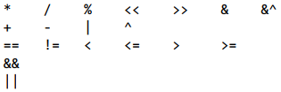
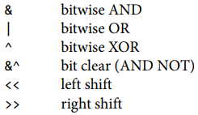
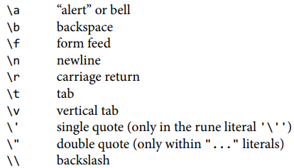
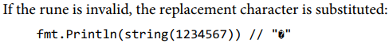

# 1 Tutorial

## command

$ go run

$ go bulid

## Package

Each source file begins with a package declaration that states which package the file belongs to,followed by a list of other packages that it imports.

Package main is special. It defines a standalone executable program, not a library.Within package main the function main is also spqcial—it's where execution of the program begins.Whatever main does is what the program does.

## Function

keyword func, name, a parameter list, a result list, the body of the function

## Format

Many text editors can be configured to run **gofmt** each time you save a file, 

so that your source code is always properly formatted 

## Command-Line Arguments

- os.Args

It's a slice of string, the first element of os.Args, os.Args[0], is the name of the command itself, the other elements are the arguments that were presented to the program when it started execution 

# 2 Program Structure

## 2.1-Names

- Go has 25 *key words* can’t be used as names. 

| break    | default     | func   | interface | select |
| -------- | ----------- | ------ | --------- | ------ |
| case     | defer       | go     | map       | struct |
| chan     | else        | goto   | package   | switch |
| const    | fallthrough | if     | range     | type   |
| continue | for         | import | return    | var    |

- In addition, there are about three dozen *predeclared* names which are not reserved and can be redeclared

| Constants | true false iota nil                                          |
| --------- | ------------------------------------------------------------ |
| Types     | int int8 int16 int32 int64  uint uint8 uint16 uint32 uint64 uintptr  float32 float64 complex128 complex64  bool byte rune string error |
| Functions | make len cap new append copy close delete  complex real imag  panic recover |

- **The case of the first letter** of a name determines its visibility across package boundaries.

## 2.2-Declaration

- Each .go file begins with a package declaration that says what package the file is part of.

- four major kinds of **package-level** declarations

  var, const, type, func

The name of each package-level entity is visible not only throughout the source file that contains its declaration, but throughout all the files of the package.   

## 2.3-Variables

- var *name* *type* = *expression*
- Go has no uninitialized variables (zero-value mechanism)

Package-level variables are initialized before main begins, and local variables are initialized as their declarations are encountered during function execution. 

### 2.3.1-Short Variable Declarations

- *name := expression*  is a declaration, whereas = is an assignment

A short variable declaration acts like an assignment only to variables that were already declared in the same lexical block. A short variable declaration must declare at least one new variable  

### 2.3.2-Pointers

- The zero value for a pointer of any type is nil

- It is perfectly safe for a function to return the address of a **local variable** 

### 2.3.3-The new Function

- Another way to create a variable is to use the built-in function new. 

The expression new(T) creates an unnamed variable of **type T**, initializes to the zero value of T, and returns its address, which is a value of type *T 

### 2.3.4-Lifetime of Variables

- The lifetime of a **package-level variable** is the entire execution of the program 

- **local** **variable** lives on until it becomes unreachable, at which point its storage may be recycled 
- each variable that **escapes** requires an extra memory allocation

## 2.4-Assignment

The value held by a variable is updated by an assignment statement, 

### 2.4.1-Tuple Assignment

All of the right-hand side expressions are evaluated before any of the variables are updated 

### 2.4.2-Assignability

the types must exactly match, and nil may be assigned to any variable of interface or reference type  

## 2.5-Type Declarations

- type *name underlying-type*  

A type declaration defines a new named type that has the same underlying type as an existing type

- Two values of different named types cannot be **compared** directly

- Every type T has a corresponding conversion operation T(x) converts the value x to type T  

A conversion from one type to another is allowed if both have the same underlying type, or if both are unnamed pointer types that point to variables of the same underlying type, Conversions are also allowed between numeric types, and between string and some slice types  

- type’s methods

Named types also make it possible to define new behaviors for values of the type. These behaviors are expressed as a set of functions associated with the type

## 2.6-Packages and Files

- package are stored in directory $GOPATH / src / *import path*

- Packages also let us hide information by controlling which names are visible outside the package, or exported. exported identifiers start with an upper-case letter. 

### 2.6.1-imports

By default, the short name is the package name, but an import declaration may specify an alternative name to avoid a conflict 

### 2.6.2-Package Initialization

- *init function mechanism*

init functions can’t be called or referenced, but otherwise they are normal functions. Within each file, init functions are automatically executed when the program starts, in the order in which they are declared. 

## 2.7-Scope

- Don't confuse scope with lifetime

The scope of a declaration is a region of the program text; it is a **compile-time property**. The lifetime of a variable is the range of time during execution when the variable can be referred to by other parts of the program; it is a **run-time property**.

- *lexical block*

A declaration’s lexical block determines its scope, There is a lexical block for the entire source code, called the *universe block* 

# 3 Basic Data Types

Four categories:

- basic types
  - numbers, strings, booleans
- aggregate types
  - arrays, structs
- reference types
  - pointers, slices, maps, functions, channels
- interface types

## 3.1 Integers

- binary operators for arithmetic, logic, and comparison in order of decreasing precedence

- %：the sign of the remainder is always the same as the sign of the dividend
- all values of basic type are comparable
- bitwise binary operators

- binary operators for arithmetic and logic(except shifts)must have operands of the same type  

## 3.2 Floating-Point Numbers

- float32 ande float64

float32 provides 6 decimal digits of precision, whereas float64 provides about 15 digits

- special values defined by IEEE 754
  - the positive and negative infinities：+Inf, -Inf
  - not a number: NaN, (any comparison with NaN always yields false)

## 3.3 Complex Numbers

- complex64 and complex128

The built-in function *complex(real, imaginary)* creates a complex number from its real and imaginary components, and the built-in *real* and *imag* functions extract those components:  

## 3.4 Booleans

There is no implicit conversion from a boolean value to a numeric value, or vice versa.

## 3.5 Strings

- len( )

The built-in len function returns the number of bytes in a string , and the index operation s[i] retrieves the i-th byte of string s. The i-th byte of a string is not necessarily the i-th character, because the UTF-8 encoding of a non-ASCII code point requires two or more bytes.  

- substring operation s[i : j]

The result contains j-i bytes, not including the byte at index j

- The + operator makes a new string by concatenating two strings
- the byte sequence contained in a string value can never be changed

Immutability means it is safe for two copies of a string to share the same underlying memory  

### 3.5.1 String Literals

- A string value can be written as a *string literal*, a sequence of bytes enclosed in double quotes  
- *escape sequence*

- A *raw string literal* is written '......'

Raw string literals are a convenient way to write regular expressions, also useful for HTML templates, JSON literals, command usage messages, and the like, which often extend over multiple lines.

### 3.5.2 Unicode

- *rune*

Unicode, which collects all of the characters in all of the world’s writing systems, plus accents and other diacritical marks, control codes like tab and carriage return, and plenty of esoterica, and **assigns each one a standard number** called a Unicode code point or, in Go terminology, a *rune*.  We could represent a sequence of runes as a sequence of **int32** values, In this representation, which is called **UTF-32** or UCS-4, the encoding of each Unicode code point has the same size, **32 bits**.   

### 3.5.3 UTF-8

- UTF-8 is a variable-length encoding of Unicode code points as bytes.  

It uses between 1 and 4 bytes to represent each rune, but only 1 byte for ASCII characters, and only 2 or 3 bytes for most runes in common use.  

1. A high-order 0 indicates 7-bit ASCII, it is identical to convent ion al ASCII
2. A high-order 110 indicates that the rune takes 2 bytes

- *range* loop, when applied to a string , performs UTF-8 decoding implicitly.  

Each time a UTF-8 decoder, whether explicit in a call to *utf8.DecodeRuneInString* or
implicit in a *range* loop, consumes an unexpected input byte, it generates a special Unicode *replacement character*, '\uFFFD'

- [ ]rune

A []rune conversion applied to a UTF-8-encoded string returns the sequence of Unicode
code points that the string encodes; If a slice of runes is converted to a string , it produces the concatenation of the UTF-8 encodings of each rune. Converting an integer value to a string interprets the integer as a rune value, and yields the UTF-8 representation of that rune. 

### 3.5.4 Strings and Byte Slices