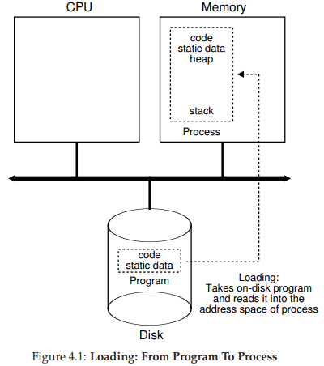
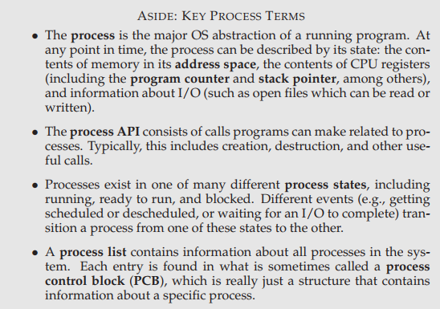

# ostep

## Preface:

\- Three major elements : virtualization、concurrency、persistence.

\- Running real code on real systems is the best way to learn about operating systems.

\- I hear and I forget. I see and I remember. I do and I understand.

## 1 A Dialogue on the book

*What are these dialogues* *for?* 

*Well, I think it is sometimesuseful to pull yourself outside of a narrative and think a bit; these dialogues are* *those* *times.* 

## 2 Introduction to Operating Systems

That is, the OS takes a **physical resource** (such as the processor, or memory, or a disk) and transforms it into a more general, powerful, and easy-to-use virtual form of itself. Thus, we sometimes refer to the operating system as a **virtual machine**.

A typical OS, in fact, exports a few hundred **system calls** that are available to applications. Because the OS provides these calls to run programs, access memory and devices, and other related actions, we also sometimes say that the OS provides a **standard library** to applications.

Finally, because virtualization allows many programs to run (thus sharing the CPU), and many programs to concurrently access their own instructions and data (thus sharing memory), and many programs to access devices (thus sharing disks and so forth), the OS is sometimes known as a **resource manager**.

### 2.1 Virtualizing The CPU

### 2.2 Virtualizing Memory

Each instruction of the program is in memory too，so memory is accessed on each instruction fetch

### 2.3 Concurrency

### 2.4 Persistence

### 2.5 Design Goals

### 2.6 Some History

Libraries-->Protection（system call）-->Multiprogramming

### 2.7 Summary

## Ⅰ Virtualization

## 3 A Dialogue on virtualization

## 4 The Abstraction：The Process

time-sharing mechanism

context switch：stop running one program and start running another on a given CPU

### 4.1 The Abstraction：A Process

machine state

what a program can read or update when it is running；Include：memory、registers、persistent storage devices

special registers：program counter(PC)（sometimes called the instruction pointer or IP），tell us which instruction of the program will execute next

A stack pointer and associated frame pointer are used to manage the run-time stack for function parameters，local variables，and return address.

### 4.2 Process API

Create、Destroy、Wait、Miscellaneous Control、Status

### 4.3 Process Creation：A little More Detail

The OS may allocate some memory for the program‘s **run-time stack** and **heap**

OS’s last task：to start the program running at the entry point，namely main( )

### 4.4 Process States

Running、Ready、Blocked

### 4.5 Data Structures

process list

### 4.6 Summary

## Ⅱ Concurrency:An Introduction

26 Concurrency:An Introduction

## Ⅲ Persistence