课程简介

# 系统能力

系统是若干相互联系、相互作用的部件结合而成，具有一定的结构和功能，并处在一定环境下的有机整体

系统能力是依据确定的系统功能，设计与开发系统结构，实现工程目标的能力

# 认识操作系统

## 执行helloworld程序操作系统做了什么

1.用户通过命令告诉os执行helloworld程序

2.os找到程序相关信息，检查文件类型是否为**可执行文件**，确定代码和数据的位置并计算对应的磁盘块地址

3.创建一个新的**进程**，将helloworld可执行文件映射到进程结构，设置CPU上下文环境，调度程序选中后开始执行

4.发生**缺页异常**，分配物理内存将代码从磁盘读入内存，然后继续执行

5.执行puts函数（**系统调用**）打印字符串

6.将字符串送往控制显示设备的进程-->字符串转换为像素信息-->显示器解释信号，显示helloworld

# 典型的操作系统

## Unix架构

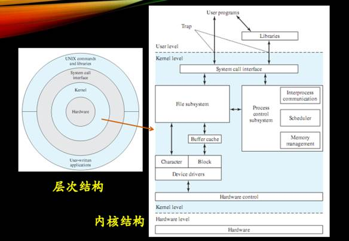

# 问题（solved）

·     TLB：Translation Lookaside Buffer，页表缓存，用于改进虚拟地址到物理地址的转译速度

·     局部性原理：时间局部性：刚引用的内存位置容易再次引用；空间局部性：刚引用的内存位置其周边容易再次被引用

·     块高速缓存：在内存中建立，减少对物理块设备的访问

·     最重要的两个寄存器：

PC(Program Counter)：用于存放下一条指令所在所在单元的地址，当执行一条指令时，首先需要根据PC中存放的指令地址，将指令*由内存取到指令寄存器*中，此过程称为“取指令”。与此同时，PC中的地址或自动加1或由转移指针给出下一条指令的地址。此后经过分析指令，执行指令。完成第一条指令的执行，而后根据PC取出第二条指令的地址，如此循环，执行每一条指令。

PSW:Program Status Word，用于OS在管态与目态转换

·     可执行文件内部结构：

ELF header：包含程序入口地址以及头外其他部分的位置和大小

Program header：与程序执行直接相关，描述即将被载入内存的段在文件中的位置、大小以及载入到内存中的位置

Section：代码段、数据段

Section header：描述了Section区域中一个节的信息

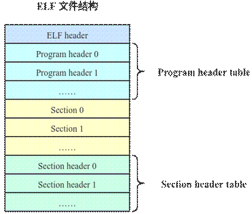

 

 

进程线程模型

2020年10月6日

15:01

# 进程模型

process定义：进程是具有独立功能的程序在某个数据集合上的一次运行过程，是系统进行资源分配和调度的独立单位

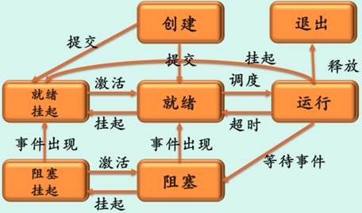

Linux

## 进程控制块PCB

Linux：task_struct；

Windows：EPROCESS、KPROCESS、PEB：Executive Process Block、Kernel Process Block与Process Environment Block，它们之间是相互包含的关系

内容包括：进程描述信息、进程控制信息、CPU现场信息、所拥有的资源和使用情况

换个角度看PCB的内容：

## 进程地址空间

进程运行时所用到的虚拟地址的集合

![计算机生成了可选文字: dd“55 Kernel。“ 《IG Usere 卩G帥 LowAddress 4G:Oxffffffff emporaryK阿《《Mapping •FIX-ADDR-START PersistentKernelMapping VmauocArea 3G．896M Mem-map Kernel《mage 36“16枘 Space EnvironmentVariables Command-linearguments kOff*t 窝〗n仃@napf跹t MemoryiSegment Filem№00刂《u的]0酽0r00 0 Heapig•up' ，0《at韧巧 fledwith'0飞矧 00《区i就4熹0ed鋣0緲湖，鼎@r “t一山0，binaryi' v到2丿 TextSe苤men《《以刎 Reserved](file:///C:/Users/99139/AppData/Local/Temp/msohtmlclip1/01/clip_image004.jpg)

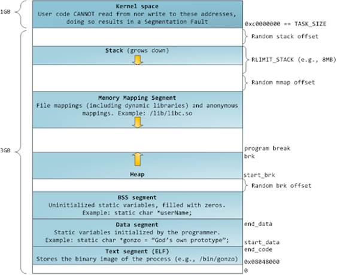

## 上下文切换

将cpu硬件状态从一个进程切换到另一个进程

进程运行时，其硬件状态保存在CPU上的寄存器中，不运行时这些寄存器的值保存在PCB中

## 进程队列

OS为每一类进程建立一个或多个队列，队列元素为PCB

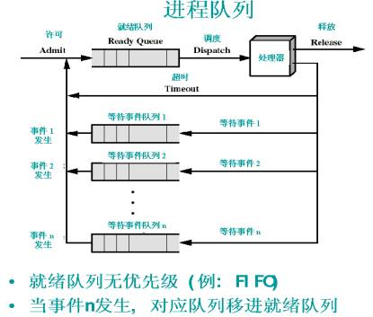

## UNIX的fork实现

# 线程模型

## 引入的理由

应用的需要，如多线程web服务器

开销的考虑，创建、撤销、切换线程以及线程间通信开销小

性能的考虑

## 线程实现

### 1.用户级线程，例POSIX

在用户空间建立线程库，内核管理进程，不知道线程的存在

优点：线程切换快，不需要内核态特权；调度算法由应用程序特定；可运行在任何操作系统上

缺点：内核阻塞进程，进程中所有线程也被阻塞；内核只将处理器分配给进程，同一进程中的两个线程不能同时运行于两个处理器上

### 2.核心级线程，例Windows线程库

内核管理所有线程，并向应用程序提供API

### 3.混合模型，例Solaris

多个用户级线程多路复用多个内核级线程，线程创建在用户态完成，调度等在核心态完成

# 问题（solved）

·     怎样实现cow：

为了节约物理内存，减少进程创建时资源和时间的消耗，父进程在调用 fork() 生成子进程时，子进程与父进程会共享同一内存区(此时两者的虚拟空间不同，但物理空间是同一个)。*只有当其中一进程进行写操作时*，系统才会为其另外分配内存页面。

·     可重入程序：允许多个进程同时访问，不允许任何进程对其进行修改

·     标准输入、标准输出、标准错误输出：

分别对应0，1，2三个文件描述符，shell会为我们自动打开，标准输入默认指向键盘，标准输出和标准错误默认指向屏幕

·     fork()：复制进程映像

fork函数调用一次能够返回两次，可能有三种不同的返回值，一个进程调用fork()函数后，系统先给新的进程分配资源和空间，然后把原来的进程的所有的值都复制到新的进程中，在fork函数执行完毕后，如果创建新进程成功，则出现两个进程，一个是子进程，一个是父进程。在子进程中，fork函数返回0，在父进程中，fork返回新创建子进程的进程ID。我们可以通过fork返回的值来判断当前进程是子进程还是父进程。如果出现错误返回一个负值

·     exec()：替换进程映像，它是一组函数的统称，实现进程执行代码的转换，会取代执行它的进程

进程调度

2020年10月14日

20:16

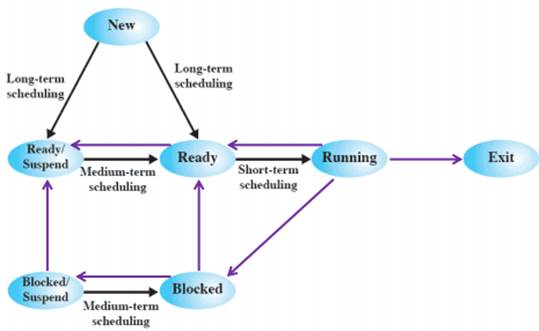

# 进程切换

·     切换**全局页目录**以加载一个新的地址空间

·     切换**内核栈和硬件上下文**

切换过程中包括对原来进程各种状态的保存和对新的进程各种状态的恢复

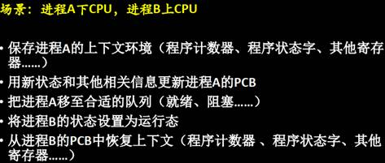

## 典型的调度算法

FCFS、SJF、SRTN、RR、HRRN、Feedback

## Windows线程调度

调度单位是线程，采用基于动态优先级的、抢占式调度，结合时间配额调整

·     使用32个优先级，分成三类，可变优先级(1-15)

·     总是选择优先级最高的就绪线程执行

·     同一优先级各线程按时间片轮转进行调度

# 多处理器调度

尽可能使进程总是在同一个CPU上执行，减少高速缓存和TLB的失效

# 问题（solved）

·     时钟中断 !=轮换，每次中断后把时间片-1，减到0后轮换

·     Page56亲和处理器：

处理器亲和性利用了这样一个事实，就是进程上一次运行后的残余信息会保留在处理器的状态中（也就是指处理器的[缓存](https://zh.wikipedia.org/wiki/CPU缓存)）。如果下一次仍然将该进程调度到同一个处理器上，就能避免一些不好的情况（比如缓存未命中），使得进程的运行更加高效。进程或线程有一个tag来指定它们倾向的处理器，；例如多处理器调度时就希望进程在亲和处理器上执行

 

 

同步机制

2020年11月11日

17:54

# 并发

并发是操作系统设计的基础

## 临界资源的访问原则

空闲让进，忙则等待，有限等待，让权等待

## 实现进程互斥的方案

### 软件方法

单标志法，违背空闲让进

双标志先检查法，违背忙则等待

双标志后检查法，会导致饥饿

Dekker's Algorithm，在解法3的基础上加入turn变量解决同时进入的饥饿问题

Peterson's Algorithm，依然未遵循让权等待

### 硬件解法

中断屏蔽法：不允许当前进程被中断也就不能发生进程切换，不可能发生两个进程同时访问临界区，只适用于操作系统内核，不适用于用户进程，因为开/关中断指令只能在内核态运行，不能将开/关中断权限交给用户

硬件指令法：TestAndSet，Swap，缺点：不满足让权等待

# 信号量及P、V操作

### 信号量

### P、V操作为原语操作

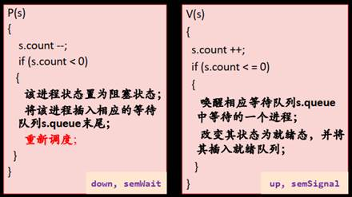

### 用PV操作解决进程间互斥问题

设置信号量mutex，初值为1

### 用信号量解决生产者/消费者问题

### 用信号量解决读者-写者问题

#### *读者**-**写着问题最核心的问题是如何处理多个读者可以同时对文件的读操作*

### ①读者优先

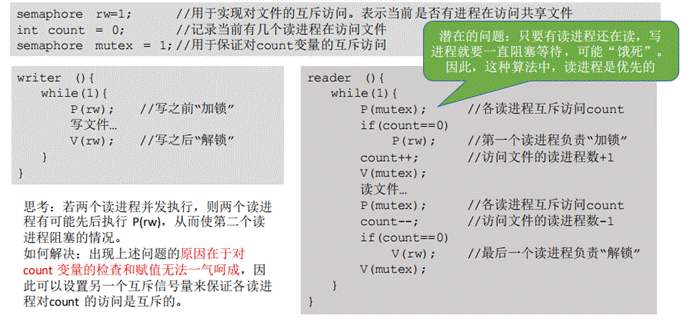

### ②读写公平法

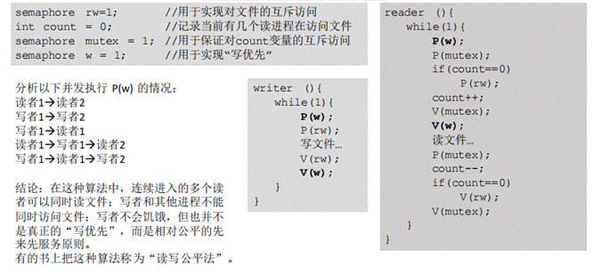

# 管程

解决信号量机制程序编写困难和效率低的问题，在编程语言中引入管程

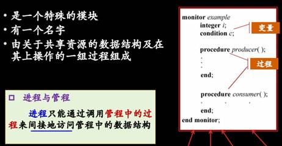

**互斥：**由编译器负责，管程是互斥进入的                                                                                                                                                                                                                                                                                                                                                                                                                                                                                                                                                                                                                                                                                                                                                                                                                                                                                                                                                                                                                                                                                                                                                                                                                                                                   

**同步：**由管程中设置条件变量及等待/唤醒操作来解决，进程在条件变量上等待时应先释放管程的使用权

## 应用管程的问题

## Hoare管程

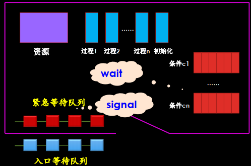

## MESA管程

针对Hoare管程的一个缺点：导致两次额外的进程切换

## 对比

## 锁

# 通过TSL指令实现锁

## 条件变量

# 进程通信

## 基本通信方式

# 死锁 

### 必要条件

①互斥条件

②不可剥夺条件

③请求并保持条件

④循环等待条件

### 死锁预防

①破坏互斥条件：资源转换技术(把独占资源变为共享资源)

②破坏不可剥夺条件：虚拟化资源

③破坏请求并保持条件：资源一次分配法

④破坏“循环等到”条件：资源有序分配法

### 死锁避免

银行家算法

## 死锁的检测与解除

### 资源分配图

### 死锁定理

死锁状态的充分必要条件是资源分配图不可完全化简

### 化简

去掉分配边，把相应的资源分配给等待该资源的进程，成为申请边

# 问题（solved）

·     优先级反转

当一个高优先级任务通过信号量机制访问共享资源时，低优先级任务持有资源，导致高优先级任务被许多低优先级任务阻塞，中优先级任务反而先于高优先级任务执行；解决方案：**优先级天花板**(当任务申请某共享资源时将该任务的优先级提升到可访问这个资源的所有任务中的最高级)和**优先级继承**(当A申请共享资源时发现正被C使用，通过比较A与C的优先级将任务C的优先级提升到A的优先级)

·     自旋锁

申请资源时如果自旋锁已经被别的执行单元保持，调用者就一直循环检查该自旋锁的保持者是否释放了自旋锁；多处理器下用自旋锁，不会使进程进入阻塞状态，减少了不必要的上下文切换

虚拟内存

2020年10月21日

20:11

# 存储体系

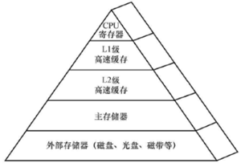

# 程序执行前的准备过程

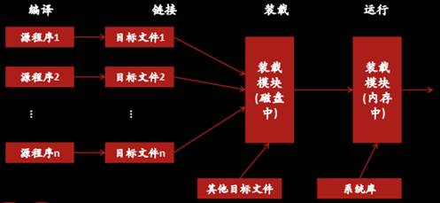

# 内存管理要解决的问题

1.支持地址重定位（程序运行时将逻辑地址转换为最终的物理地址）

2.支持地址保护（进程间地址空间不能互相访问）

# 地址重定位

静态重定位：用户程序加载到内存时一次性实现逻辑地址到物理地址的转换

动态重定位：进程执行过程中(即逐条指令执行时)完成地址转换

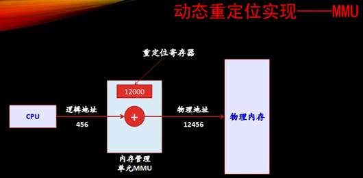

# 地址保护

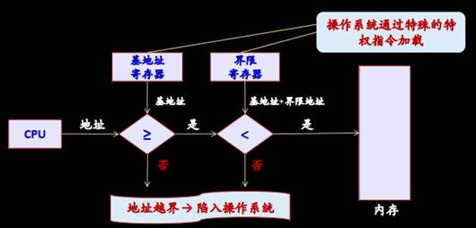

# 内存管理方案

## 伙伴系统，一种经典的内存分配方案

2^u-1 < s <= 2^u，一直划分下去直到产生大于等于s的最小块

## 空闲内存管理

位图、空闲区表、空闲块链表

## 内存分配算法

首次适应、下次适应、最佳适应、最坏适应

## 基本内存管理方案

### 1.固定分区

每个分区的大小可以相同也可以不同，分区后大小**固定不变**

### 2.可变分区

根据进程的需要把空闲空间分割出一个分区，剩余部分成为新的空闲区

会产生碎片---->很小的、不易利用的空闲区，采用紧缩技术（memory compaction，在内存移动程序，将所有小的空闲区合并为较大的空闲区）

### 3.页式存储管理

# 内存扩充

## 内存紧凑

对于可变分区管理方案的空闲区域

## 覆盖技术

同一程序的不同部分在内存中相互替代

## 交换技术

将内存中某些进程暂时移到外存，把外存中某些进程换进内存

## 虚存技术

# 虚拟页式存储管理

## 基本思想

装载程序时先装入几个甚至零个页面，如果进程执行时需要的页面不在内存，则动态装入所需页面

需要时，将内存中暂时不用的一些页面交换到磁盘，以获得更多的内存空间

## 两种方式

请求调页

预先调页

## 设计与实现的问题

### 1.页表表项设计

### PDE页目录项：Page Directory Entry

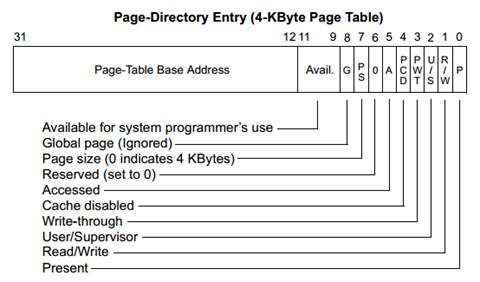

### PTE页表项：Page Table Entry

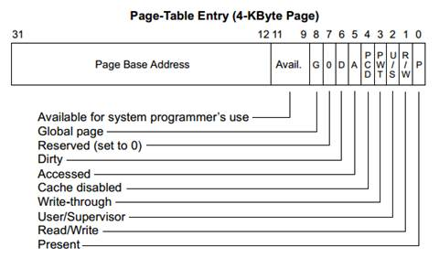

 

### 2.关于页表

一个进程的页表的各页在内存中若不连续存放，则需要引入页目录表(每进程一个)

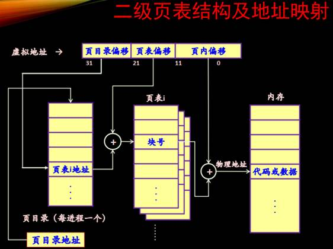

# 反转(反置、反向)页表

页表项含index(页帧号)、进程PID和VPN(虚拟页号）

## 不用hash的反向页表

从第一个开始一个一个比对

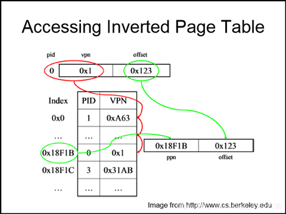

## 用hash表的反向页表

将vpn与PID做hash运算，将该值作为index直接查找，因为可能会有冲突，需要比较PID和VPN不同则查找Next

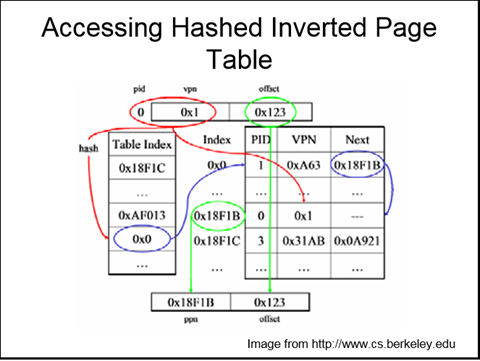

# 地址转换

### TLB

相联存储器（associative memory）：按内容寻址的存储器

# Intel Core I7 Memory System

### L1

数据缓存只缓存数据，指令缓存只缓存指令

### L2

统一缓存，可以缓存指令和数据

### L3

位于芯片外部被所有核共享，L1与L2在核内部

通过TLBI找到set，然后通过tag查找，将32位TLBT后与VPN前32位比较，四路同时比，若相同则hit，得到PPN

cache有64个set，每个set有8line，根据CI找到set，用CT比较每line，找到后根据CO在line中找到data

# Page Fault

# 驻留集

# 页面置换

## 置换范围

## 置换策略

不能置换锁定的页框

![计算机生成了可选文字: 算法 NRLJ SecondChance CIO LRLJ NFLJ Aging Workingset WSClock 评价 不可实现，但可作为基准 LRLJ的很粗的近似 可能淘汰重要的页面 比F]FO有很大的改善 现实的 很优秀，但很难实现 I-RU的相对粗略的近似 非常近似的有效算法 实现起来开销很大 好的有效的算法](file:///C:/Users/99139/AppData/Local/Temp/msohtmlclip1/01/clip_image004.jpg)

# 清除策略

# 页缓冲技术

减少磁盘I/O

![计算机生成了可选文字: 思路 的不丢弃置换出的页，将它们放入两个表之一：如果未被 修改，则放到亠弓]，如果修改了，则放到过改 血冱应中 到被修改的页以簇方式写回磁盘（不是一次只写一个，减少 I/O操作的数量，从而减少了磁盘访问时间） 到被置换的页仍然保留在内存中，一旦进程又要访问该页， 可以迅速将它加入该进程的驻留集合（代价很小）](file:///C:/Users/99139/AppData/Local/Temp/msohtmlclip1/01/clip_image002.jpg)

内存映射文件

### Copy-On-Write

为了节约物理内存，减少进程创建时资源和时间的消耗，父进程在调用 fork() 生成子进程时，子进程与父进程会共享同一内存区(此时两者的虚拟空间不同，但物理空间是同一个)。*只有当其中一进程进行写操作时*，处理器会产生Page Fault，由操作系统完成内存页的复制。这就是写时复制机制 (copy on write) 的意思

# 问题：（solved）

·     进程地址空间：

stack段：

通常⽤来存储局部变量和函数参数和函数调⽤后返回的地址。效率很⾼，但是分配的内存容量有限。如果创建⼤数组或递归深度过深会导致栈的空间不够，从⽽发⽣栈溢出 

heap段：动态分配的内存，大小不固定

memory mapping segment

bss段(读/写)：存放未初始化的全局变量

data段(只读)：存放已初始化的全局变量，global vars,static vars,string constants

text段(只读)：代码段

·     交换技术相关：

1.进程的哪些内容要交换到磁盘？

主要交换的内容应该是进程运行时创建或修改的内容，也就是栈和堆的内容，至于代码部分，由于不需要修改且在外存上有备份，由此不需要被交换出去保存，直接丢弃即可。

2.在磁盘的什么位置保存被换出的进程？

交换区（备份区）：系统指定一块特殊的磁盘区域作为交换空间（swap space），包含连续的磁道，操作系统可以使用底层的磁盘读写操作对其高效访问。不同的操作系统对交换区的叫法不一样，如Windows系统称为页文件pagefile。

3.何时需要发生交换？

一种是进程只要不用或者很少再用的就换出；

第二种使用更多的策略则是内存空间不够或有不够的危险时启动交换程序换出。lniux系统就是采用这种策略。

4.如何选择被换出的选程？

**根据进程的各种属性，**有些进程在内存里是不能随意搬家的。处于等待IO状态的进程也不能随意被交换出去。

5.如何处理进程空间增长？

一般采用预留空间的方法

·     TLB多大？

通常只存放16-64个页表项，当进程进行上下文切换时重新设置cr3寄存器，并且刷新TLB

 

 

 

 

文件系统

2020年12月9日

19:41

# 基本概念

文件是对磁盘的抽象，所谓文件是指一组带标识（即文件名）的、在逻辑上有完整意义的信息项的序列

信息项：构成文件内容的基本单位，各信息项之间具有顺序关系

## 文件系统

## 文件的分类

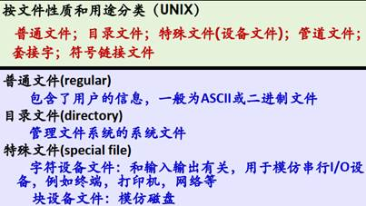

## 文件的逻辑结构

### 流式文件

### 记录式文件

顺序文件、索引文件、索引顺序文件

## FCB

文件属性或元数据，存放为了管理文件所需的所有有关信息

## 文件目录

将所有文件的管理信息组织在一起，目录项可以是FCB

# 文件系统的实现

实现文件系统需要考虑磁盘与内存中的内容布局

 

 

## 相关术语

## 磁盘上的内容

### ①引导区

每个分区一个，通常为第一个扇区，包括从该卷引导操作系统所需要的信息

### ②分区信息

包括该分区的块数、块大小、空闲块数量和指针、空闲FCB数量和指针

### ③目录文件

### ④用户文件

## 磁盘上文件系统的布局

### UNIX文件系统布局

### FAT文件系统布局

### 一个NTFS卷的布局

## 文件的物理结构

①顺序结构

②链接结构

③索引结构

## 目录文件的改进

将FCB分成两部分：符号目录项和基本目录项(例如inode)

能减少查找一个文件的平均访盘次数

# 文件系统实例

## UNIX文件系统

FCB = 目录项 + inode

目录文件由目录项构成

每个文件由一个目录项、一个inode和若干磁盘块构成

## WINDOWS-FAT16文件系统

FAT表项：2字节，目录项：32字节

FAT16的根目录大小固定，FAT32的根目录区不固定而是数据区的一部分，采用与子目录文件相同的管理方式

FAT16命名规则为8.3，8指文件名，3指扩展名；FAT32支持长文件名格式，以13个字符为单位进行切割，每一组占据一个目录项，这时长文件名的各个目录项按倒序排列在目录表中

# 磁盘空间管理

### 位图法、空闲块法、空闲块链表

## 计算

已知块号、扇区数(每条磁道)、磁头数

数据的读/写按柱面进行，在同一驻面的所有磁头全部读写完毕后磁头才转移到下一柱面

柱面号 = 块号 / (扇区数 * 磁头数)

磁头号 = ( 块号 mod (扇区数 * 磁头数) ) / 扇区数

## 成组链接法

各组的第一个盘块构成一条链；

需要一个空闲盘块号栈用来存放当前可用的一组空闲盘块号(最多含100个号)以及栈中尚有的空闲盘块号数N

运行环境和运行机制

2020年11月25日

21:11

# 操作系统运行环境

## CPU

由运算器(ALU)、控制器、一系列寄存器以及高速缓存组成

## 寄存器

### 用户可见的寄存器

减少程序访问内存次数，数据(通用)寄存器、地址寄存器、条件码寄存器

### 控制和状态寄存器

PC、IR、PSW

## 保护

需要**硬件**提供基本的运行机制：处理器具有**特权级别**，能在不同的特权级别运行不同的指令集合

## CPU状态之间的转换

## 中断机制

## 中断与异常的引入原因

## 事件

中断/异常是CPU对系统发生的某个事件作出的一种反应

## 工作原理

·     处理器控制部件中设有**中断寄存器**，CPU在每条指令周期的最后时刻扫描中断寄存器，查看是否有中断信号

### ①

### ②

中断向量表：一个内存单元，存放中断处理程序的入口地址

### ③

### ④

# 时钟中断的作用

# IA32体系结构对中断的支持

中断控制器：负责将硬件的的中断信号转换为中断向量，引发CPU中断

实模式：中断向量表（Interrupt Vector table）

保护模式：中断描述符表（Interrupt Descripter table）

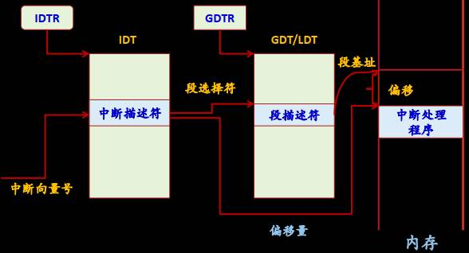

# 系统调用

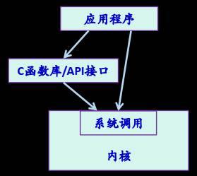

## 参数传递

# 机制与策略分离原则

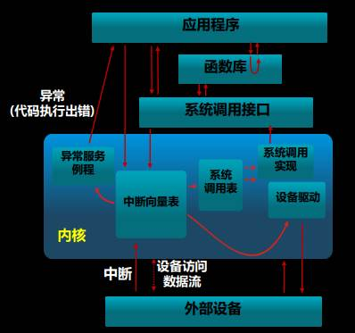

 

 

 

 