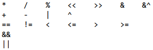
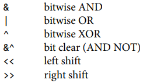

# 1 Tutorial

## Package

Package *main* is special. It defines a standalone executable program, not a library. Within package main the function main is also special — it's where execution of the program begins. Whatever main does is what the program does.

## Format

gofmt

## Command-Line Arguments

os.Args

It's a slice of string, the first element of os.Args, os.Args[0], is the name of the command itself, the other elements are the arguments that were presented to the program when it started execution.

# 2 Program Structure

## 2.1-Names

- Go has 25 *key words* can’t be used as names. 


| 1        | 2           | 3      | 4         | 5      |
| -------- | ----------- | ------ | --------- | ------ |
| break    | default     | func   | interface | select |
| case     | defer       | go     | map       | struct |
| chan     | else        | goto   | package   | switch |
| const    | fallthrough | if     | range     | type   |
| continue | for         | import | return    | var    |

- 
  | *predeclared.names* | which are not reserved and can be redeclared                 |
  | ------------------- | ------------------------------------------------------------ |
  | constants           | true false iota nil                                          |
  | Types               | int int8 int16 int32 int64  uint uint8 uint16 uint32 uint64 uintptr  float32 float64 complex64 complex128                                                  bool byte(uint8) rune(int32) string error |
  | Functions           | make len cap new append copy close delete  complex real imag  panic recover |


- **The case of the first letter** of a name determines its visibility across package boundaries.

## 2.2-Declaration

Each .go file begins with a package declaration that says what package the file is part of.

The name of each package-level entity is visible not only throughout the source file that contains its declaration, but throughout all the files of the package.   

four major kinds of **package-level** declarations: type, const, var, func

## 2.3-Variables

var *name* *type* = *expression*

Go has no uninitialized variables (zero-value mechanism)

Package-level variables are initialized before main begins, and local variables are initialized as their declarations are encountered during function execution. 

### 2.3.1-Short Variable Declarations

*name := expression*  is a declaration, whereas = is an assignment

A short variable declaration acts like an assignment only to variables that were already declared in the same lexical block. A short variable declaration must declare at least one new variable  

### 2.3.2-Pointers

It is perfectly safe for a function to return the address of a **local variable** 


### 2.3.3-The new Function

Built-in function new. 

The expression new(T) creates an unnamed variable of **type T**, initializes to the zero value of T, and returns its address, which is a value of type *T 

### 2.3.4-Lifetime of Variables

The lifetime of a **package-level variable** is the entire execution of the program 

**local** **variable** lives on until it becomes unreachable, at which point its storage may be recycled 

each variable that **escapes** requires an extra memory allocation

## 2.4-Assignment

The value held by a variable is updated by an assignment statement

### 2.4.1-Tuple Assignment

All of the right-hand side expressions are evaluated before any of the variables are updated 

### 2.4.2-Assignability

The types must exactly match, and nil may be assigned to any variable of interface or reference type  

## 2.5-Type Declarations

type *name underlying-type*  

A type declaration defines a new named type that has the same underlying type as an existing type

- Two values of different named types cannot be **compared** directly

- Every type T has a corresponding conversion operation T(x) converts the value x to type T  

  A conversion from one type to another is allowed if both have the same underlying type, or if both are unnamed pointer types that point to variables of the same underlying type, conversions are also allowed between numeric types, and between string and some slice types  


## 2.6-Packages and Files

package are stored in directory $GOPATH / src / *import path*

Packages also let us hide information by controlling which names are visible outside the package


### 2.6.1-imports

By convention, a package’s name matches the last segment of its import path

### 2.6.2-Package Initialization

*init function mechanism*

init functions can’t be called or referenced, but otherwise they are normal functions. Within each file, init functions are **automatically executed** when the program starts, in the order in which they are declared. 

## 2.7-Scope

Don't confuse scope with *lifetime*

The scope of a declaration is a region of the program text; it is a **compile-time property**. The lifetime of a variable is the range of time during execution when the variable can be referred to by other parts of the program; it is a **run-time property**.

- *lexical block*

  A declaration’s lexical block determines its scope, there is a lexical block for the entire source code, called the *universe block* 

# 3 Basic Data Types

Four categories:

- basic types
  - numbers, strings, booleans
- aggregate types
  - arrays, structs
- reference types
  - pointers, slices, maps, functions, channels
- interface types

## 3.1 Integers

binary operators for arithmetic, logic, and comparison in order of decreasing precedence:



- %：the sign of the remainder is always the same as the sign of the dividend

  so `-5%3` and `-5%-3` are both `-2`  

- all values of basic type are comparable

bitwise binary operators:



- z = x &^ y：each bit of z is 0 if the corresponding bit of y is 1; otherwise it equals the corresponding bit of x.  
- binary operators for arithmetic and logic (except shifts) must have operands of the same type
- Two *fmt.Printf* tricks：
  1.  `[1]`adverbs after % tell Printf to use the first operand.
  2.  `#`adverb for `%o` or `%x` or `%X` tells Printf to emit a 0 or 0x or 0X prefix respectively.  

- Rune literals are written as a character within single quotes.

  Runes are printed with `%c`, or with `%q` if quoting is desired. 

## 3.2 Floating-Point Numbers

float32 ande float64

float32 provides 6 decimal digits of precision, whereas float64 provides about 15 digits

- Very small or very large numbers are better written in **scientific notation**. 
- *Printf adverb*：`%g`、`%e` (exponent)、`%f` (no exponent). All three verbs allow field width and numeric precision to be controlled.  

- special values defined by IEEE 754
  - the positive and negative infinities：+Inf, -Inf

  - not a number: NaN, (any comparison with NaN always yields false, except  != )

    The function **math.IsNaN** tests whether its argument is a not-a-number value  

    ```go
    var z float64
    fmt.Println(z,-z,1/z,-1/z,z/z) // "0 -0 +Inf -Inf NaN"
    nan := math.NaN()
    fmt.Println(nan != nan, nan == nan, nan < nan, nan > nan)
    // "true false false false"
    fmt.Println(math.IsNaN(nan)) // "true"
    ```

## 3.3 Complex Numbers

complex64 and complex128

The built-in function *complex(real, imaginary)* creates a complex number from its real and imaginary components,

built-in *real* and *imag* functions extract those components  

## 3.4 Booleans

There is no implicit conversion from a boolean value to a numeric value, or vice versa.

## 3.5 Strings

A string is an immutable sequence of bytes.

The built-in ***len*** function returns the number of bytes(not runes) in a string , and the index operation s[i] retrieves the i-th byte of string s. 

The **i-th byte** of a string is not necessarily the **i-th character**, because the UTF-8 encoding of a non-ASCII code point requires two or more bytes.  

- The **substring** operation s[i : j] yields a new string.

- The + operator makes a new string by concatenating two strings
- The **byte** sequence contained in a string value can never be changed (but we can assign a new value to a string variable or to append one string to another). Immutability means it is safe for two copies of a string to share the same underlying memory. 

### 3.5.1 String Literals

A string value can be written as a *string literal*, a sequence of bytes enclosed in double quotes  

- *escape sequence*


- A *raw string literal* is written '......'

  no escape sequences are processed; the contents are taken literally  

  Raw string literals are a convenient way to write *regular expressions*, also useful for HTML templates, JSON literals, command usage messages, and the like, which often extend over multiple lines.

### 3.5.2 Unicode

A ***Unicode code point***, in Go terminology called a ***rune***.  We could represent a sequence of runes as a sequence of **int32** values, In this representation, which is called **UTF-32** or UCS-4, the encoding of each Unicode code point has the same size, **32 bits**.   

### 3.5.3 UTF-8

UTF-8 is a variable-length encoding of Unicode code points as bytes.  

It uses between 1 and 4 bytes to represent each rune, but only 1 byte for ASCII characters, and only 2 or 3 bytes for most runes in common use.  

- A high-order 0 indicates 7-bit ASCII, it is identical to conventional ASCII
- A high-order 110 indicates that the rune takes 2 bytes, the second byte begins with 10


- Unicode escapes: \uhhhh for a 16-bit and \Uhhhhhhhh for a 32-bit value

- ***range*** loop, when applied to a string , performs UTF-8 decoding implicitly.

- A [ ]rune conversion applied to a UTF-8-encoded string returns the sequence of Unicode code points that the string encodes; If a slice of runes is converted to a string, it produces the concatenation of the UTF-8 encodings of each rune. 

- Converting an integer value to a string interprets the integer as a rune value, and yields the UTF-8 representation of that rune.

  ```go
  fmt.Println(string(65)) // "A", not "65"
  fmt.Println(string(0x4eac)) // "京"
  ```

- Each time a UTF-8 decoder, whether explicit in a call to ***utf8.DecodeRuneInString*** or implicit in a ***range*** loop, consumes an unexpected input byte, it generates a special Unicode *replacement character*, '\uFFFD'


### 3.5.4 Strings and Byte Slices

Four standard packages for manipulating strings

**strings, strconv, bytes, unicode**

- [ ]byte(s)

  The [ ]byte(s) conversion allocates a new byte array holding a copy of the bytes of s, and yields a slice that references the entirety of that array.  

- *bytes.Buffer*

  The bytes package provides the **Buffer** type for efficient manipulation of byte slices  

### 3.5.5 Conversions between Strings and Numbers

integer to string

`fmt.Sprintf; strconv.Itoa; `

string to integer

`strconv.Atoi; strconv.Parseint`

## 3.6 Constants

The results of all arithmetic, logical, and comparison operations applied to constant operands are themselves constants, as are the results of conversions and calls to certain built-in functions.

### 3.6.1 The Constant Generator iota

*enumerations*, or *enums* for short  

### 3.6.2 Untyped Constants

uncommitted constants

The compiler represents these uncommitted constants with much greater numeric **precision** than values of basic types. There are six flavors of these uncommitted constants, called **untyped boolean**, **untyped integer**, **untyped rune**, **untyped floating-point**, **untyped complex**, and **untyped string**. When an untyped constant is assigned to a variable, the constant is implicitly converted to the type of that variable if possible.

# 4 Composite Types

## 4.1 Arrays

- The built-in function len returns the number of elements in the array.
- use an *array literal* to initialize an array

  Indices can appear in any order and some may be omitted, unspecified values take on the zero value for the element type


- The size of an array is part of its type                                    
- If an array’s element type is comparable then the array type is comparable too.

## 4.2 Slices

A slice is a lightweight data structure that gives access to a subsequence (or perhaps all) of the elements of an array, which is known as the slice’s *underlying array*.

A slice has three components: a **pointer**, a **length**, and a **capacity**

- slices are not comparable, The standard library provides *bytes.Equal* for comparing two slices of bytes, but for other types of slice, we must do the comparison ourselves.    

- The only legal slice comparison is against nil

- built-in function ***make***, cap can be omitted.

  `make ([]T,len,cap)`

  Under the hood, *make* creates an unnamed array variable and returns a slice of it.

### 4.2.1 The append Function

The built-in ***append*** function appends items to slices

built-in function ***copy*** copies elements from one slice to another of the same type, returns the number of elements actually copied, which is the smaller slice's length.

### 4.2.2 In-Place Slice Techniques

## 4.3 Maps

A map is a reference to a hash table

- The key type K must be comparable using ==

- Map elements are removed with the built-in function **delete**

  `delete(ages,"alice") // remove element ages["alice"]`

- a map lookup using a key that isn’t present returns the zero value for its type

- a map element is not a variable, and we cannot take its address

  `_ = &ages["bob"] // complie error: cannot take address of map element`

  One reason that we can’t take the address of a map element is that growing a map might cause rehashing of existing elements into new storage locations   

- Subscripting a map in this context yields two values; the second is a boolean that reports whether the element was present

  `if age, ok := ages["bob"]; !ok {/* bob is not a key */}`

## 4.4 Structs

A struct is a variable, and its fields are variables too.

The name of a struct *field* is exported if it begins with a capital letter 

### 4.4.1 Struct Literals

1. values be specified for every field, in the right order
2. listing some or all of the field names and their corresponding values  

### 4.4.2 Comparing Structs

If all the fields of a struct are comparable, the struct it self is comparable.


### 4.4.3 Struct Embedding and Anonymous Fields

*anonymous fields*:

Declare a field with a type but no name, the type of the field must be a named type or a pointer to a named type, we can refer to the names at the leaves of the implicit tree

```go
w = Wheel{Circle{Point{8,8},5},20}
w = Wheel{
    Circle: Circlle{
        Point: Point{X:8, Y:8},
        Radius: 5,
    },
    Spokes: 20,
}
```

## 4.5 JSON

The basic JSON types are numbers(in decimal or scientific notation), booleans(true or false), and strings, which are sequences of Unicode code points enclosed in double quotes. These basic types maybe combined recursively using JSON arrays and objects.

- *field tags*

  A field tag is a string of meta data associated at compile time with the field of a struct

  The first part of the json field tag specifies an alternative JSON name for the Go field,

  an additional option, *omitempty* indicates that no JSON output should be produced if the field has the zero value for its type  

- *marshaling*, *unmarshaling*  

## 4.6 Text and HTML Templates

- {{action}}

  A template is a string or file containing one or more portions enclosed in double braces, {{...}}, called *actions*.

  Each action contains an expression in the template language

  the | notation makes the result of one operation the argument of another  

# 5 Functions

## 5.1 Function Declarations

The type of a function is sometimes called its signature

A function declaration without a body indicating that the function is implemented in a language other than Go, such a declaration defines the function signature.  

## 5.2 Recursion

Go implementations use ***variable-size stacks***.

## 5.3 Multiple Return Values

To ignore one of the values, assign it to the *blank identifier*

- *bare return*

  In a function with named results, the operands of a return statement may be omitted   

## 5.4 Errors

If the failure has only one possible cause, the result is a **boolean**, usually called ok

the failure may have a variety of causes, the type of the additional result is **error**

The built-in type *error* is an **interface type**, an error may be nil or non-nil, a non-nil error has an error message string  

### 5.4.1 Error-Handling Strategies

When a function call returns an error, it’s the caller’s responsibility to check it and take appropriate action:

1. *propagate* the error

   provide a clear causal chain from the root problem to the overall failure  

   *fmt.Errorf*  formats an error message using *fmt.Sprintf* and returns a new error value  

2. *retry* the failed operation

3. print the error and stop the program gracefully  

   this course of action should generally be reserved for the main package of a program

   ```go
   fmt.Fprintf(os.Stderr,"Site is down: %v\n",err)
   os.Exit(1)
   //A more convenient way:
   //by default it prefixes the time and date to the error message 
   log.Fatalf("Site is down: %v\n",err)
   ```

4. log the error and then continue

   (All log functions append a newline if one is not already present)  

   ```go
   //using the log package,which adds the usual prefix
   log.Printf("ping failed:%v;networking disabled",err)
   //printing directly to the standard error stream
   fmt.Fprintf(os.Stderr,"ping failed:%v;networking disabled\n",err)
   ```

5. In rare cases we can safely ignore an error entirely

### 5.4.2 End of File(EOF)

io.EOF is the error returned by Read when no more input is available.

## 5.5 Function Values

Functions are *first-class* values in Go: like other values, function values have types, and they may be assigned to variables or passed to or returned from functions, they are not comparable, the zero value of a function type is nil

## 5.6 Anonymous Functions

***closures***  

use a *function literal* to denote a function value within any expression

The anonymous inner function can access and update the local variables of the enclosing function. These hidden variable references are why we classify functions as **reference types** and why function values are not comparable.

### 5.6.1 Caveat: Capturing Iteration Variables

```go
var rmdirs []func()
for _, dir := range tempDirs() {
	os.MkdirAll(dir, 0755)
	rmdirs = append(rmdirs, func() { os.RemoveAll(dir) }) // NOTE: incorrect!
}
```

All function values created by this loop ‘‘capture’’ and share the same variable—an addressable storage location, not its value at that particular moment  

## 5.7 Variadic Functions

A *variadic function* is one that can be called with varying numbers of arguments

the type of the final parameter is preceded by an *ellipsis*, ‘‘...’’

`func sum(vals ...int) int`

Implicitly, the caller allocates an array, copies the arguments into it, and passes a slice of the entire array to the function, when the arguments are already in a slice: place an *ellipsis* after the final argument.  

## 5.8 Deferred Function Calls

The function and argument expressions are evaluated when the statement is executed, but the actual call is deferred until the function that contains the ***defer*** statement has finished, whether normally, by executing a return statement or falling off the end, or abnormally, by panicking

Any number of calls may be deferred, they are executed in the reverse of the order in which they were deferred

- The defer statement can be used to pair ‘‘on entry’’ and ‘‘on exit’’ actions

- Deferred functions run **after** (return statements have updated the function’s result variables). 

  A *deferred anonymous function* can even change the values that the *enclosing function* returns to its caller.

## 5.9 Panic

During a typical panic, normal execution stops, all **deferred function** calls in that goroutine are executed, and the program crashes with a **log message**

This log message includes the **panic value**, which is usually an error message of some sort,  and for each goroutine, a **stack trace** showing the stack of function calls that were active at the time of the panic  

Not all panics come from the runtime. The built-in *panic* function may be called directly 

## 5.10 Recover

If the built-in *recover* function is called within a deferred function and the function containing the defer statement is panicking , *recover* ends the current state of panic and returns the **panic value**

# 6 Methods

## 6.1 Method Declarations

Methods may be declared on any named type defined in the same package, so long as its underlying type is neither a pointer nor an interface.

func | method’s *receiver* | method name | ...

*selector*: selects method or fields of struct types

## 6.2 Methods with a Pointer Receiver

method declarations are not permitted on named types that are themselves pointer types

```go
type P *int
func (P) f() { ... } //complie error: invalid receiver type
```

compiler will perform an implicit `&p` or implicit `*pptr`

### 6.2.1 Nil is a Valid Receiver Value

When define a type whose methods allow nil as a receiver value, it’s worth pointing this out explicitly in its documentation comment.

## 6.3 Composing Types by Struct Embedding

Embedding allows complex types with many methods to be built up by the *composition* of several fields, each providing a few methods. The type of an anonymous field may be a pointer to a named type.  

**Terms of implementation:**

the embedded field instructs the compiler to generate additional wrapper methods that delegate to the declared methods.

**unnamed struct types** methods:

Methods can be declared only on named types and pointers to them, but thanks to embedding, it’s possible and sometimes useful for unnamed struct types to have methods too.

## 6.4 Method Values and Expressions

The selector `p.Distance` yields a *method value*, a function that binds a method to a specific receiver value p.

*method expression*: yields a function value with a regular first parameter taking the place of the receiver, it can be called in the usual way.

## 6.5 Example: Bit Vector Type


## 6.6 Encapsulation

*information hiding*

limits access to the fields of a struct or the methods of a type.

# 7 Interfaces

Interface types express generalizations or abstractions about the behaviors of other types.

An interface is an *abstract type* (vs *concrete type*) . It doesn’t expose the representation or internal structure of its values or the set of basic operations, it reveals only some of their **methods**

*satisfied implicitly*

## 7.1. Interfaces as Contracts

The `io.Writer` interface defines the **contract** between `Fprintf` and its callers:

1. the contract requires that the caller provide a value of a concrete type like `*os.File` or `*bytes.Buffer` that has a method called `Write` with the appropriate signature and behavior.
2. the contract guarantees that `Fprintf` will do its job given any value that satisfies the `io.Writer` interface

This freedom to substitute one type for another that satisfies the same interface is called *substitutability*

## 7.2. Interface Types

An interface type specifies a set of methods that a **concrete type** must possess to be considered an **instance** of that interface.

The `io.Writer` type is one of the most widely used interfaces because it provides an abstraction of all the types to which bytes can be written, which includes files, memory buffers, network connections, HTTP clients, archivers, hashers, and so on.

*embedding* an interface

## 7.3. Interface Satisfaction

a concrete type ‘‘is a’’ particular interface type, meaning that it satisfies the interface.

an interface wraps and conceals the concrete type and value that it holds, only the methods revealed by the interface type may be called, even if the concrete type has others

- assignability rule

  an expression may be assigned to an interface only if its type satisfies the interface

- *empty interface type*

  places no demands on the types that satisfy it, we can assign any value to the empty interface

- occasionally useful to document and assert the relationship

  ```go
  //example: asserts at compile time 
  //bytes.Buffer must satisfy io.Writer
  var w io.Writer = new(bytes.Buffer)
  //a moe frugal variant:
  var _ io.Writer = (*bytes.Buffer)(nil)
  ```

- A concrete type may satisfy many unrelated interfaces

## 7.4. Parsing Flags with flag.Value

```go
package flag
// Value is the interface to the value stored in a flag.
type Value interface {
	String() string
	Set(string) error
}
```

define new notations for *command-line flags*.

## 7.5. Interface Values

***dynamic type*** and  ***dynamic value***


Assignment involves an implicit conversion from a concrete type to an interface type, and is equivalent to the explicit conversion `io.Writer(os.Stdout)` 

In an interface value, the type component is represented by the appropriate *type descriptors*.

interface values are **comparable**

### 7.5.1 Caveat: An Interface Containing a Nil Pointer Is Non-Nil


## 7.6. Sorting with sort.Interface

use sort.Interface to specify the contract between the generic sort algorithm and each sequence type that may be sorted.

The sort package defines an unexported type *reverse*, which is a struct that embeds a sort.Interface, the exported function *Reverse* returns an instance of the reverse type.

```go
package sort
type Interface interface {
    Len() int
    Less(i, j int) bool
    Swap(i, j int)
}

type reverse struct{ Interface } // that is, sort.interface
func (r reverse) Less(i, j int) bool { return r.Interface.Less(j,i) }
//Len and Swap, the other two methods of reverse, are implicitly provided by the original.
func Reverse(data Interfaxe) Interface { return reverse{data} }
```

## 7.7. The http.Handler Interface

```go
package http

type Handler interface {
    ServeHTTP(w ResponseWriter, r *Request)
}
func ListenAndServe(address string, h Handler) error
//HandlerFunc is an adapter that lets a function value satisfy an interface
type HandlerFunc func(w ResponseWriter, r *Request)
func (f Handlerfunc) ServerHTTP(w ResponseWriter, r *Request) {
    f(w,r)
}
```

## 7.8. The error Interface

```go
type error interface {
    Error() string
}

package errors
func New(text string) error { return &errorString{text} }
type errorString struct { text string }
// The underlying type of errorString is a struct, not a string, to protect its representation from inadvertent (or premeditated) updates
func (e *errorString) Error() string { return e.text }
// the pointer type *errorString, not errorString alone, satisfies the error interface is so that every call to New allocates a distinct error instance that is equal to no other

// a convenient wrapper function fmt.Errorf
func Errorf(format string, args ...interface{}) error {
    return errors.New(Sprintf(format,args...))
}
```

## 7.9. Example: Expression Evaluator

--

## 7.10. Type Assertions

`x.(T)`, x is an expression of interface type, T is a concrete type or non-nil interface type, called *asserted type*.

A type assertion checks that the *dynamic type* of its operand matches the asserted type

## 7.11. Discriminating Errors with Type  Assertions

use a type assertion to detect the specific type of the error

## 7.12. Querying Behaviors with Interface Type Assertions

uses a type assertion to see whether a value of a general interface type also satisfies a more specific interface type, and if so, it uses the methods of the specific interface

## 7.13. Type Switches

Interfaces are used in two distinct styles:

1. The emphasis is on the methods, not on the concrete types

   an interface’s methods express the similarities of the concrete types that satisfy the interface but hide the representation details and intrinsic operations of those concrete types

2. *discriminated unions*

   exploits the ability of an interface value to hold values of a variety of concrete types and considers the interface to be the *union* of those types, the emphasis is on the concrete types that satisfy the interface, not on the interface’s methods, and there is no hiding of information. **Type assertions** are used to discriminate among these types dynamically and treat each case differently
   
   `switch x := x.(type) {...}` 

## 7.14. Example: Token-Based XML Decoding

--

## 7.15. A Few Words of Advice

--

# 8 Goroutines and Channels 217-256

*communicating sequential processes*（CSP)

## 8.1. Goroutines

*main goroutine*  

When main function returns, all goroutines are abruptly terminated and the program exits

## 8.2. Example: Concurrent Clock Server

`go handleConn(conn)`

## 8.3. Example: Concurrent Echo Server

--

## 8.4. Channels

A channnel is a communication mechanism that lets one goroutine send values to another goroutine

Each channel is a conduit for values of a particular type, called the channel’s *element type*

A channel has two principal operations, *send* and *receive* `<-`, and a third operation, *close*

Receive operations on a closed channel yield the values that have been sent until no more values are left

If the *capacity* is non zero, *make* creates a *buffered* channel  

### 8.4.1. Unbuffered Channels

Communication over an unbuffered channel causes the sending and receiving goroutines to *synchronize*

*happens before*

When the *event* carries no additional information, its sole purpose is synchronization.

### 8.4.2. Pipeline

the output of one is the input to another

After the closed channel has been *drained*, that is, after the last sent element has been received, all subsequent receive operations will proceed without blocking but will yield a **zero value**

A channel that the garbage collector determines to be unreachable will have its resources reclaimed whether or not it is closed

### 8.4.3. Unidirectional Channel Type

it is a compile-time error to attempt to close a receive-only channel (`<-chan int`)

Conversions from bidirectional to unidirectional channel types are permitted in any assignment, but no going back

### 8.4.4. Buffered Channels


## 8.5. Looping in Paralle

## 8.6. Example: Concurrent Web Crawler

## 8.7. Multiplexing with select

## 8.8. Example: Concurrent Directory Traversal

## 8.9. Cancellation

## 8.10. Example: Chat Server