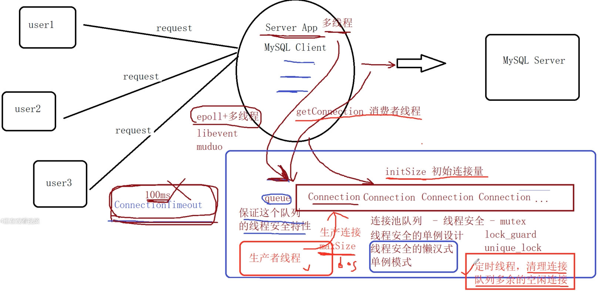

# MySQL Connection Pool

- **项目背景：**

为了提高MySQL数据库（基于C/S设计）的访问效率有两种途径：

1.在服务器端增加缓存，减少数据库的磁盘IO的次数

2.增加连接池，减少在高并发情况下：大量的TCP三次握手，MySQL Server连接认证、MySQL Server关闭连接回收资源和TCP四次挥手所耗费的性能和时间

 

- **连接池功能介绍**

连接池一般包含了数据库连接所使用的ip地址、port端口号、用户名和密码以及其他的性能参数： 

**初始连接量(initSize)**：连接池事先会和MySQL Server创建的连接个数，当应用发起MySQL访问时，不用再和MySQL Server创建新的连接，直接从连接池中获取一个可用的连接即可

**最大连接量(maxSize)**：访问请求增加后连接池的连接数量会动态增加，但连接池和服务器程序是部署在一台主机上的，连接池不能占用太多socket资源

**最大空闲时间(maxIdle Time)**：新增加的连接在指定的时间未被再次使用时需要被回收掉 

**连接超时时间(connection Timeout)**：当没有空闲连接可用时，应用通过阻塞的方式等待获取连接，如果超时那么获取连接失败

 

- **功能实现设计**

public.h：宏定义LOG打印日志信息，使用编译器内置宏打印出调试信息

__FILE__ 包含当前程序文件名的字符串

__LINE__ 表示当前行号的整数

__DATE__ 包含当前日期的字符串

__STDC__ 如果编译器遵循ANSI C标准，它就是个非零值

__TIME__ 包含当前时间的字符串

 

\#pragma once是一个预处理指令，保证头文件只被编译一次

//sprintf( )函数不安全将属性---C/C++---常规---SDL检查改成否

 

**一、MySQL数据库操作代码、增删改查代码实现（Connection****.****h）**

- MySQL数据库编程直接采用oracle公司提供的MySQL C/C++客户端开发包，包含了mysql.h头文件和libmysql库文件

在Connection类中增加一个成员变量记录进入空闲状态后的起始存活时间，增加一个返回存活时间的的成员函数和刷新起始的空闲时间点的成员函数

Windows命令行进入MySQL Command Line Client步骤：

1.进入MySQL安装目录下的bin目录：

2.输入mysql -u root -p

3.输入密码123456

 

**二、连接池代码实现（ConnectionPool****.****h）**

所有技术在C++语言层面直接实现，可以跨平台编译 

1.连接池只需要一个实例，以线程安全的懒汉式单例模式进行设计

获取实例的接口函数的实现采用了C++11后的最简洁的跨平台方案：Meyers Singleton：

1）构造函数私有化

2）静态函数获取连接池对象实例

3）连接池定义为静态局部变量

静态局部变量不仅只会初始化一次，而且是线程安全的，因为静态局部变量初始化编译器会自动调用lock和unlock：

互斥对象的主要操作有两个加锁(lock)和释放锁(unlock)。当一个线程对互斥对象进行lock操作并成功获得这个互斥对象的所有权，在此线程对此对象unlock前，其他线程对这个互斥对象的lock操作都会被阻塞。

2.添加连接池参数的配置文件 mysql.ini，并定义从配置文件加载配置项的函数

ini：即初始化文件，是windows的系统配置文件所采用的存储格式

使用C++文件操作处理，先找到=的位置，再找到\n的位置，截取=前后的key和value

使用到的库函数：

find( “xx”，n)：从字符串下标n开始查找，返回字母在母串中的位置

substr( i，n )：从i开始返回长度为n的字符串

stoi()：把string转换成int输出

3.连接池的构造函数

1)加载配置项

2)创建初始数量的连接

3)启动一个生产者线程，作为连接的生产者

4)启动一个定时线程，扫描超过maxIdleTime时间的空闲连接，进行多余的连接回收

4.实现被生产者线程调用的生产连接的线程函数

1）使用unique_lock维护连接队列的线程安全

2）设置条件变量，用于生产者线程和消费者线程的同步通信  //条件变量是利用线程间共享的全局变量进行同步的一种机制，条件变量是和互斥锁一起使用的

3）该生产者线程函数会一直循环运行，若连接队列非空则阻塞，等待消费者线程通知；队列若空，生产连接并通知消费者

5.实现消费者线程获取连接的函数，为外部提供接口

1）用户获取的连接用shared_ptr智能指针来管理，用lambda表达式重定义删除器，用完后把连接归还而不是释放

2）若连接队列为空则阻塞，等待生产者生产连接后通知或其他消费者归还连接后通知，若等待超时未被唤醒则获取失败

3）若队列不空则获取队头连接，此时若队列空了则通知生产者生产连接

6.实现被定时线程调用的函数，清理连接队列多余的空闲连接

1）首先睡眠，模拟定时效果

2）扫描整个队列，释放多余的连接

 

**三、压力测试**

建表：

| CREATE TABLE user ( |                                        |
| ------------------- | -------------------------------------- |
|                     | id int(11) NOT NULL AUTO_INCREMENT,    |
|                     | name varchar(50) NULL,                 |
|                     | age int(11)  NULL,                     |
|                     | sex  enum('male','female') NULL,       |
|                     | PRIMARY KEY (id)                       |
|                     | ) ENGINE=InnoDB DEFAULT  CHARSET=utf8; |

验证数据的插入操作所花费的时间，第一次测试使用普通的数据库访问操作，第二次测试使用带连接池

的数据库访问操作，对比两次操作同样数据量所花费的时间，性能压力测试结果如下： 

| **数据量** | **未使用连接池花费时间**       | **使用连接池花费时间**         |
| ---------- | ------------------------------ | ------------------------------ |
| 1000       | 单线程：2409ms 四线程：835ms   | 单线程：1527ms 四线程：661ms   |
| 5000       | 单线程：12718ms 四线程：4076ms | 单线程： 7800ms 四线程：3179ms |
| 10000      | 单线程：24413ms 四线程：7857ms | 单线程：15070ms 四线程：6443ms |

单线程模式下花费时间减少30%左右

多线程模式下花费时间减少20%左右

